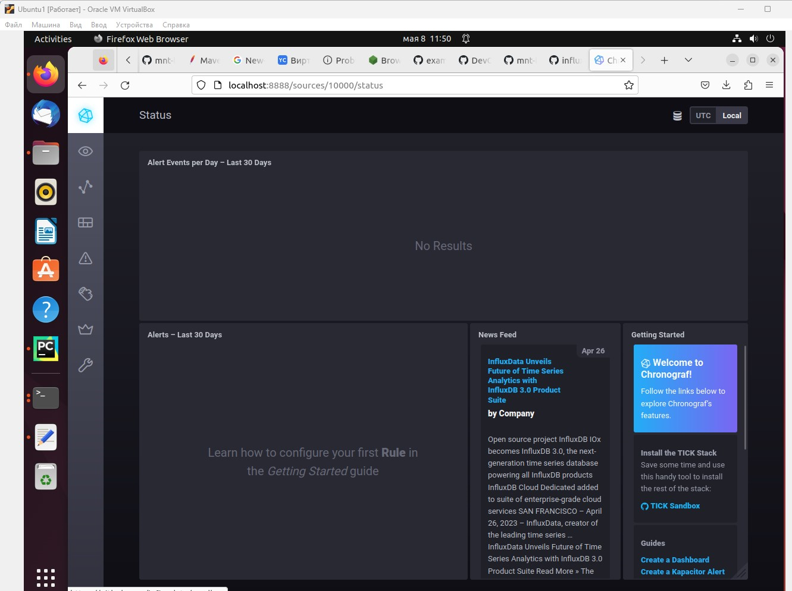
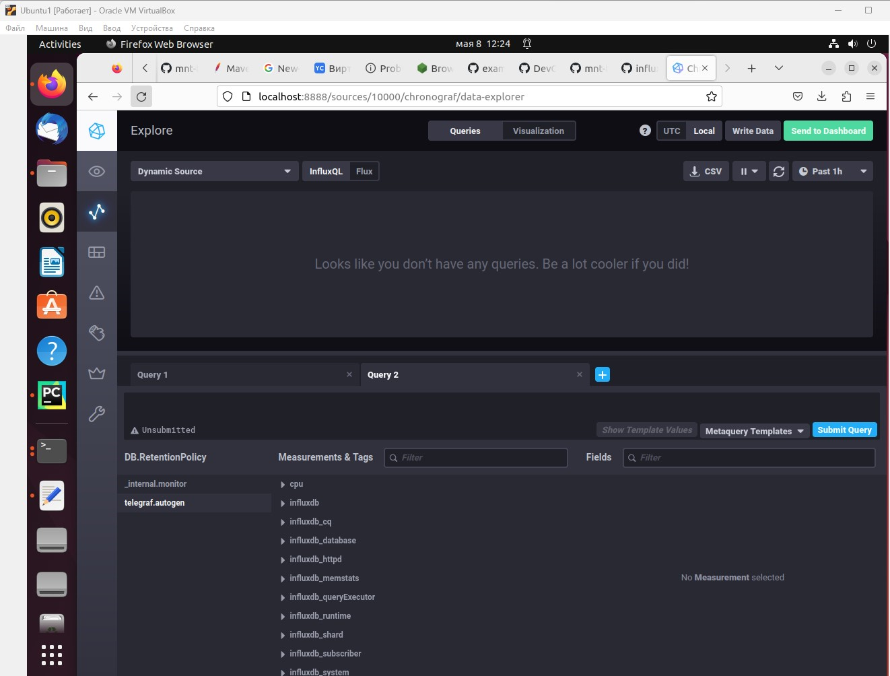
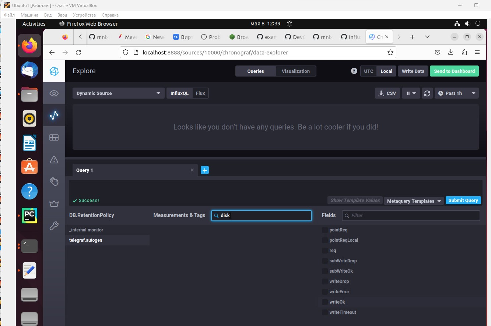
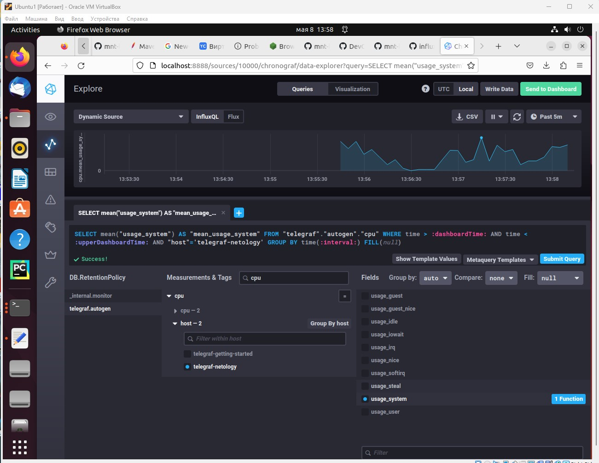
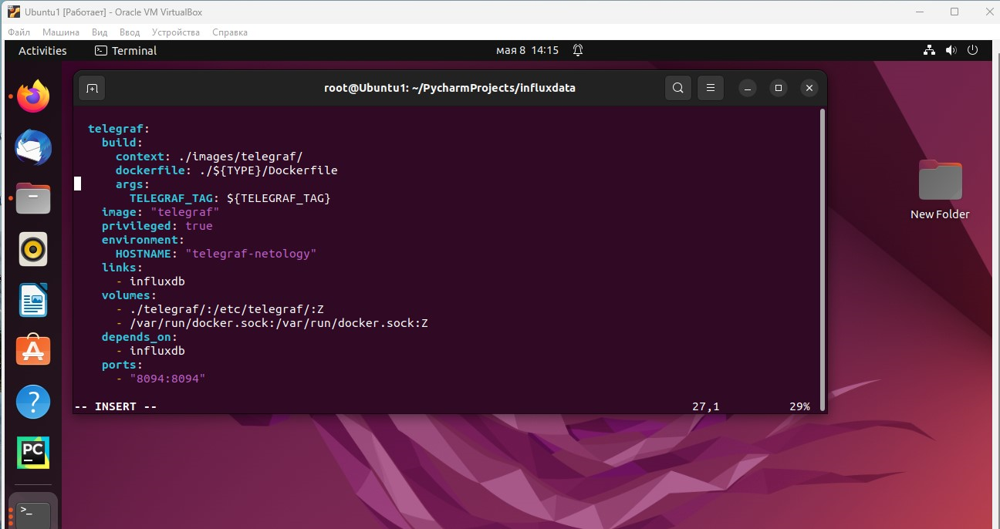
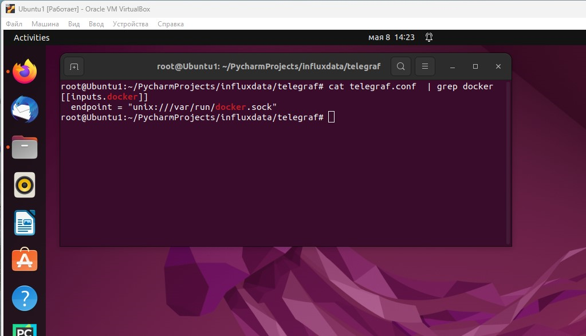

##  Домашнее задание к занятию 13 "Введение в мониторинг" ##

#### 1.Вас пригласили настроить мониторинг на проект. На онбординге вам рассказали, что проект представляет из себя платформу для вычислений с выдачей текстовых отчетов, которые сохраняются на диск. Взаимодействие с платформой осуществляется по протоколу http. Также вам отметили, что вычисления загружают ЦПУ. Какой минимальный набор метрик вы выведите в мониторинг и почему? ####

_Инфраструктурные метрики:_

CPU Uage,  CPU load average,

Memory Usage,

Disk Queue Length,

Disk Free Space,

Inode usage,

Загруженность сетевого интерфейса,

Доступность порта http

_Бизнез-метрики:_

Объём выгружаемых данных,

Cкорость загрузки/формирования отчёта, 

время доступности АС

#

#### 2.Менеджер продукта посмотрев на ваши метрики сказал, что ему непонятно что такое RAM/inodes/CPUla. Также он сказал, что хочет понимать, насколько мы выполняем свои обязанности перед клиентами и какое качество обслуживания. Что вы можете ему предложить? ####

RAM - количество оперативной памяти , используемой проектом, влияющее на быстродействие системы/проекта

Inodes - количество доступных файловых дескрипторов, для предотвращения их переполнения и невозможности записи файлов отчётов

CPUla - средняя загрузка процессора, влияющая на быстродействие системы/проекта

Для того чтобы понимать , насколько мы выполняем свои обязанности, необходимо сравнить фактические значения метрик (SLI) со значениями , указанными в SLO (SLA).  Главным образом это касается бизнес-метрик, например времени формирвания отчёта, времени доступности АС. Для наглядности  можно вывести метрики на дашборд и настроить алертинг, где в качестве пороговых значений будут значения, указанные в SLO  или близкие к ним.
#

#### 3.Вашей DevOps команде в этом году не выделили финансирование на построение системы сбора логов. Разработчики в свою очередь хотят видеть все ошибки, которые выдают их приложения. Какое решение вы можете предпринять в этой ситуации, чтобы разработчики получали ошибки приложения? ####


Наиболее предпочтительное решение - использовать Opensource-решения: например стек ELK или Sentry, Для визуализации можно использовать Grafana 
#

#### 4.Вы, как опытный SRE, сделали мониторинг, куда вывели отображения выполнения SLA=99% по http кодам ответов. Вычисляете этот параметр по следующей формуле: summ_2xx_requests/summ_all_requests. Данный параметр не поднимается выше 70%, но при этом в вашей системе нет кодов ответа 5xx и 4xx. Где у вас ошибка? ####


Необходимо также учитывать коды ответов 1xx и 3xx, они тоже могут присутствовать, особенно редирект
Формулу можно дополнить ``` (summ_1xx_requests + summ_2xx_requests + summ_3xx_requests)/summ_all_requests ```
#
#### 5. Опишите основные плюсы и минусы pull и push систем мониторинга. ####


Push-модель:
- Можно указать несколько точек отправки

- Можно варьировать параметры отправки

- Нельзя со стороны сервера контролировать нагрузку

Pull-модель

- Можно централизованно задавать агентов, которых необходимо опрашивать

- Можно поставить proxy-server для опроса агентов для более безопасного взаимодействия с системой мониторинга
  
- В целях отладки можно самостоятельно забирать метрики с агентов не системой мониторинга
#

#### 6. Какие из ниже перечисленных систем относятся к push модели, а какие к pull? А может есть гибридные? ####

Prometheus - pull

TICK - push

Zabbix - обе модели

VictoriaMetrics - обе модели

Nagios - push
#

#### 7. Склонируйте себе репозиторий и запустите TICK-стэк, используя технологии docker и docker-compose. ####

#### В виде решения на это упражнение приведите скриншот веб-интерфейса ПО chronograf (http://localhost:8888) ####


#
#### 8. Перейдите в веб-интерфейс Chronograf (http://localhost:8888) и откройте вкладку Data explorer ####



#### Для выполнения задания приведите скриншот с отображением метрик утилизации места на диске (disk->host->telegraf_container_id) из веб-интерфейса ####

Метрики по диску почему-то отсутствуют



Поэтому привожу скриншот метрик по cpu


#

#### 9. Изучите список telegraf inputs. Добавьте в конфигурацию telegraf следующий плагин - docker: ####

#### После настройке перезапустите telegraf, обновите веб интерфейс и приведите скриншотом список measurments в веб-интерфейсе базы telegraf.autogen . Там должны появиться метрики, связанные с docker ####

К сожалению не удалось добиться отображения метрик docker, хотя все настройки вроде бы выполнены






