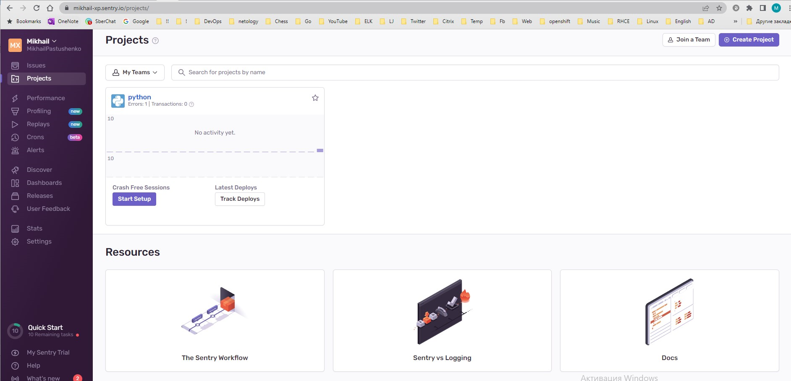
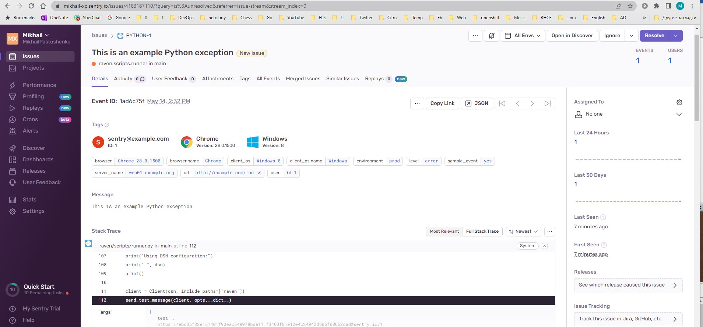
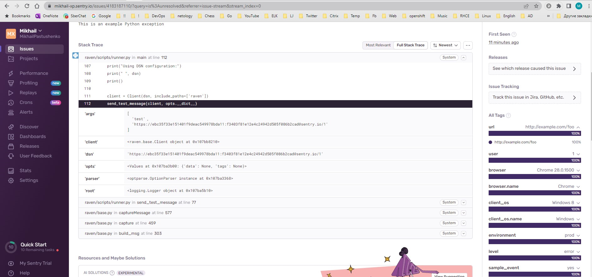
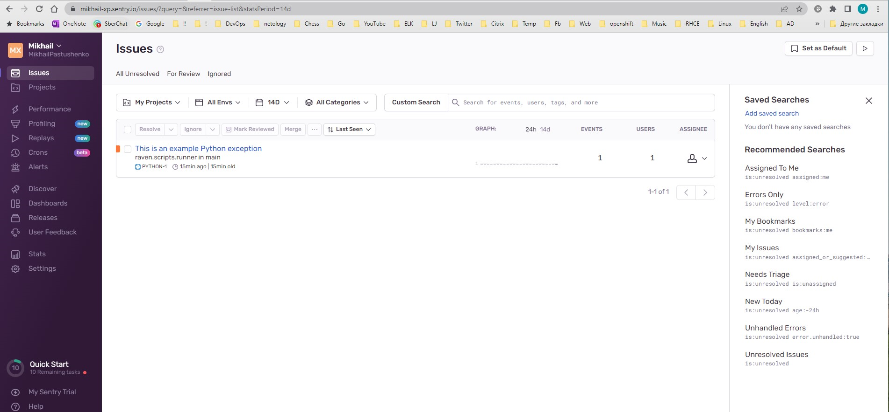
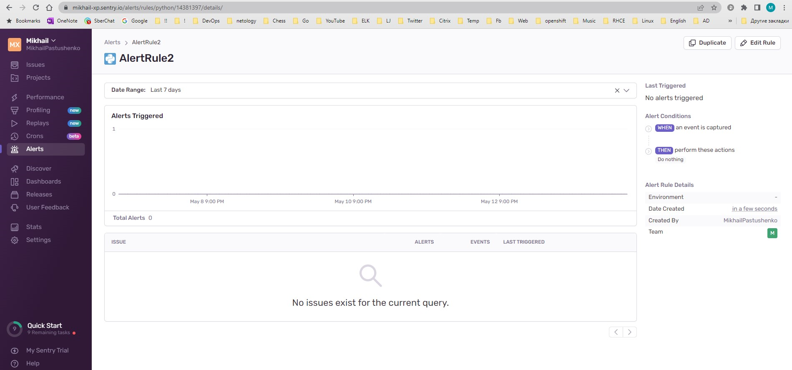
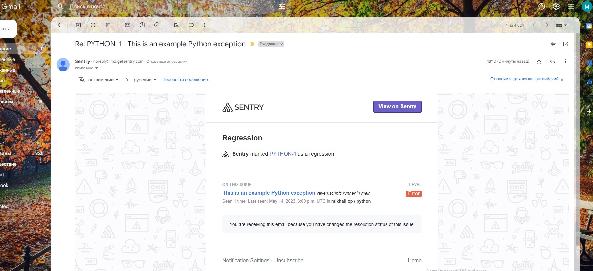

## Домашнее задание к занятию 16 «Платформа мониторинга Sentry» ##

### Задание 1  ###
#

#### - зайдите на sentry.io; ####
#### - нажмите «Try for free»; ####
#### - используйте авторизацию через ваш GitHub-аккаунт; ####
#### - далее следуйте инструкциям. ####

#### В качестве решения задания пришлите скриншот меню Projects. ####

### Задание 2 ###
#

#### Создайте python-проект и нажмите Generate sample event для генерации тестового события. ####

#### Изучите информацию, представленную в событии. ####

#### Перейдите в список событий проекта, выберите созданное вами и нажмите `Resolved`. ####

#### В качестве решения задание предоставьте скриншот `Stack trace` из этого события и список событий проекта после нажатия `Resolved`. ####

### Задание 3 ###
#

#### Перейдите в создание правил алёртинга. ####

#### Выберите проект и создайте дефолтное правило алёртинга без настройки полей. ####

#### Снова сгенерируйте событие Generate sample event. Если всё было выполнено правильно — через некоторое время вам на почту, привязанную к GitHub-аккаунту, придёт оповещение о произошедшем событии. ####

#### Если сообщение не пришло — проверьте настройки аккаунта Sentry (например, привязанную почту), что у вас не было sample issue до того, как вы его сгенерировали, и то, что правило алёртинга выставлено по дефолту (во всех полях all). Также проверьте проект, в котором вы создаёте событие — возможно алёрт привязан к другому. ####

#### В качестве решения задания пришлите скриншот тела сообщения из оповещения на почте. ####

