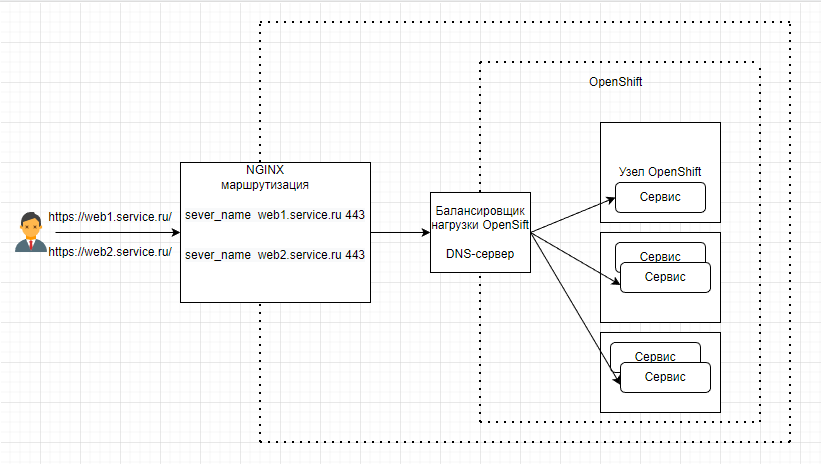

## Домашнее задание к занятию "Микросервисы: масштабирование" ##

#### Вы работаете в крупной компанию, которая строит систему на основе микросервисной архитектуры. Вам как DevOps специалисту необходимо выдвинуть предложение по организации инфраструктуры, для разработки и эксплуатации. ####

### Задача 1: Кластеризация ###

#### Предложите решение для обеспечения развертывания, запуска и управления приложениями. Решение может состоять из одного или нескольких программных продуктов и должно описывать способы и принципы их взаимодействия. ####

Ответ:

Если нет требований к тому , чтобы ПО было свободно распространяемое, то в основе решения я бы поставил RedHat OpenShift , как самое удобное и функциональное ПО (В противном случае Kubernetes)

_• Поддержка контейнеров:_ +

_• Обеспечивать обнаружение сервисов и маршрутизацию запросов:_ маршрутизация NGINX + встроенный в OpenShift DNS-сервер

_• Обеспечивать возможность горизонтального масштабирования:_ +

_• Обеспечивать возможность автоматического масштабирования:_ + (посредством строенного функционала ReplicaSet)

_• Обеспечивать явное разделение ресурсов доступных извне и внутри системы:_ +

_• Обеспечивать возможность конфигурировать приложения с помощью переменных среды, в том числе с возможностью безопасного хранения чувствительных данных таких как пароли, ключи доступа, ключи шифрования и т.п:_ + для безопасного хранения паролей можно воспользоваться плагином от Hashicorp Vault