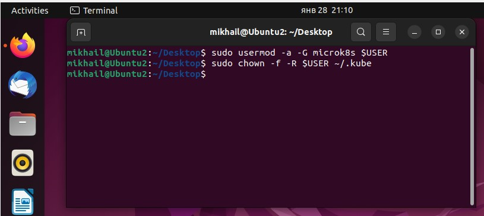
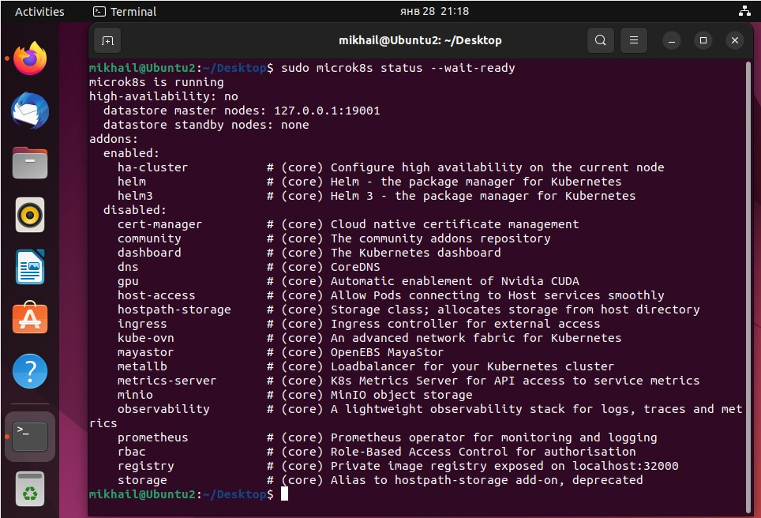
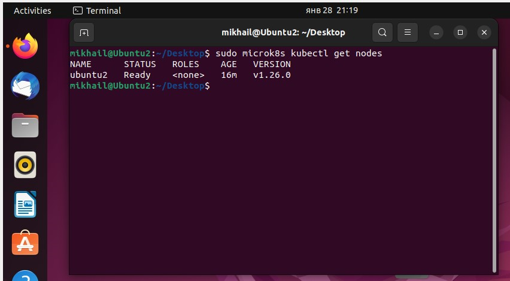
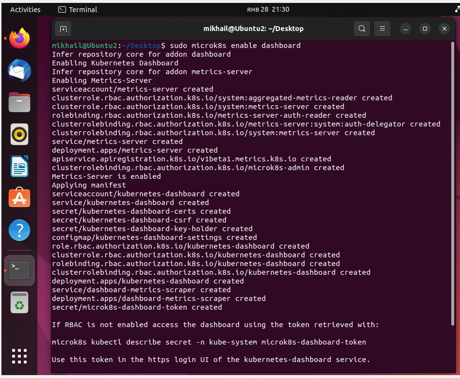
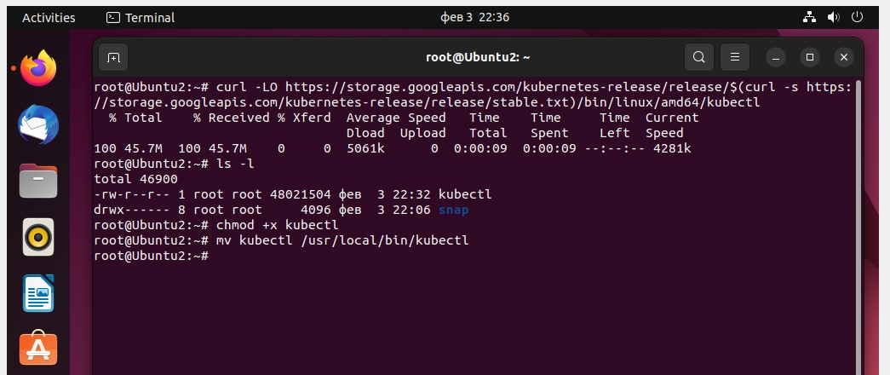
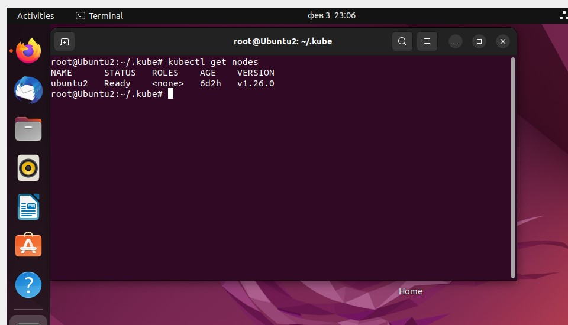
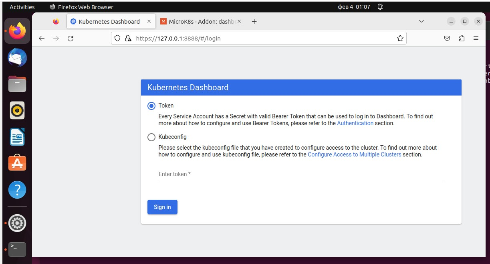
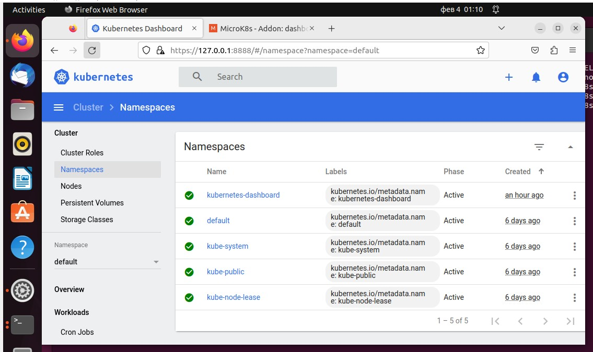

## Домашнее задание к занятию "Kubernetes. Причины появления. Команда kubectl" ##

### Задание 1. Установка MicroK8S ###

#### 1. Установить MicroK8S на локальную машину или на удаленную виртуальную машину ####

Устанавливаю локально 








#### 2. Установить dashboard ####



### Задание 2. Установка и настройка локального kubectl

#### 1. Установить на локальную машину kubectl ####



#### 2. Настроить локально подключение к кластеру ####




#### 3. Подключиться к дашборду с помощью port-forward ####




сгенерил и вставил токен  ```microk8s kubectl create token default```

