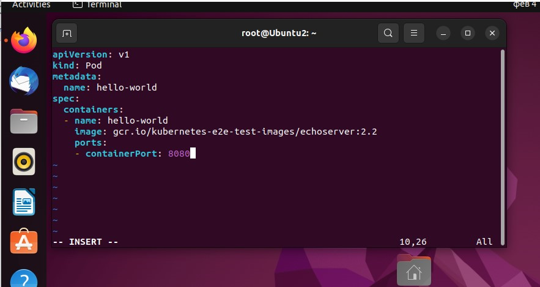
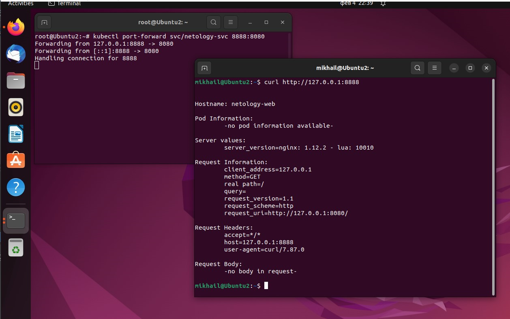

## Домашнее задание к занятию "Базовые объекты K8S" ##

### Задание 1. Создать Pod с именем "hello-world" ###

#### Создать манифест (yaml-конфигурацию) Pod ####

#### Подключиться локально к Pod с помощью kubectl port-forward и вывести значение (curl или в браузере) ####

### Задание 2. Создать Service и подключить его к Pod ###

#### Создать Pod с именем "netology-web" ####

#### Создать Service с именем "netology-svc" и подключить к "netology-web" ####

#### Подключиться локально к Service с помощью kubectl port-forward и вывести значение (curl или в браузере) ####

