## Домашнее задание к занятию "Запуск приложений в K8S" ##

### Задание 1. Создать Deployment и обеспечить доступ к репликам приложения из другого Pod'а" ###

#### Создать Deployment приложения состоящего из двух контейнеров - nginx и multitool. Решить возникшую ошибку ####

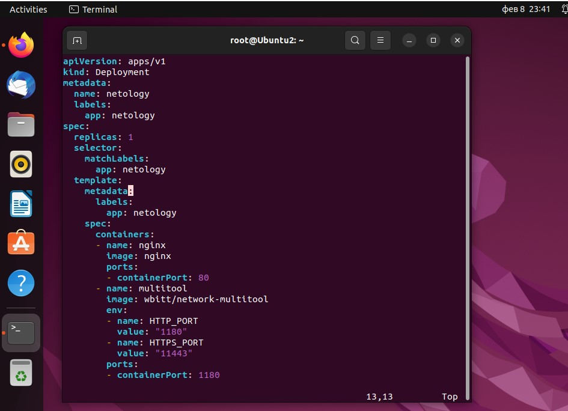

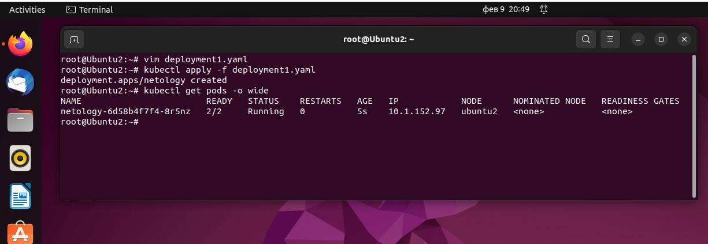

#### После запуска увеличить кол-во реплик работающего приложения до 2 ####

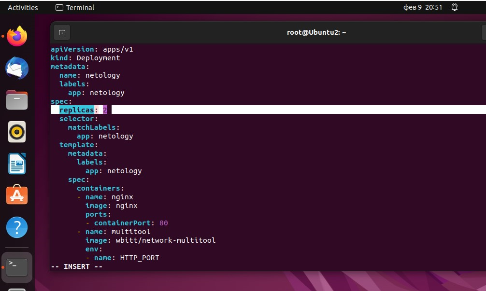

#### Продемонстрировать кол-во подов до и после масштабирования ####

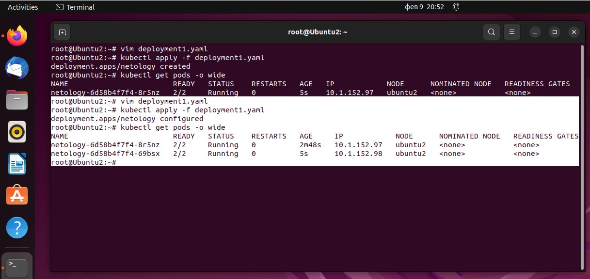

#### Создать Service, который обеспечит доступ до реплик приложений из п.1 ####

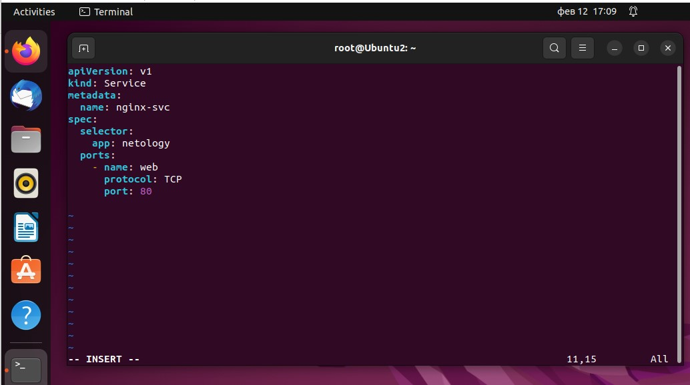

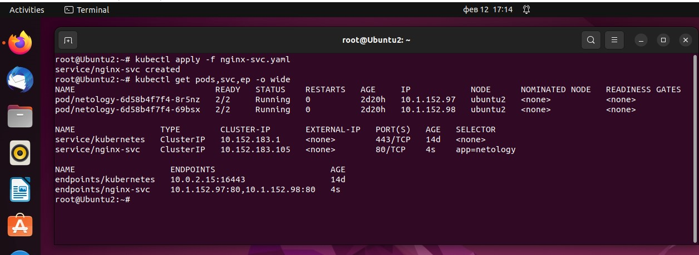

#### Создать отдельный Pod с приложением multitool и убедиться с помощью curl что из пода есть доступ до приложений из п.1 ####

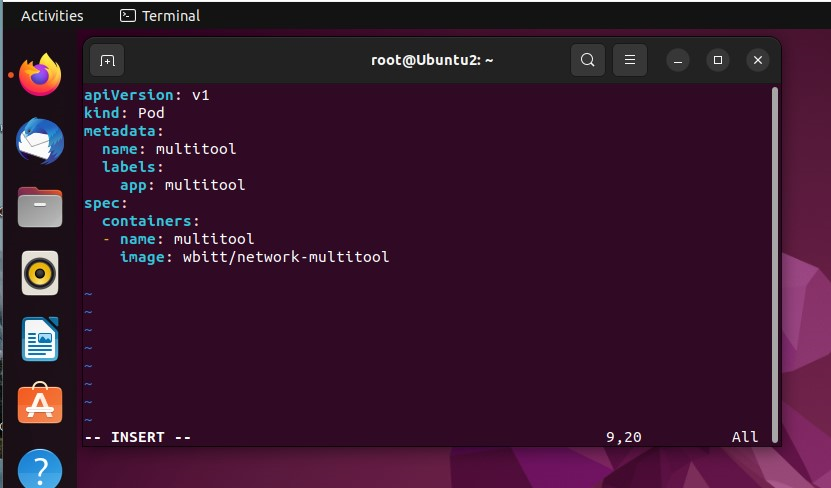

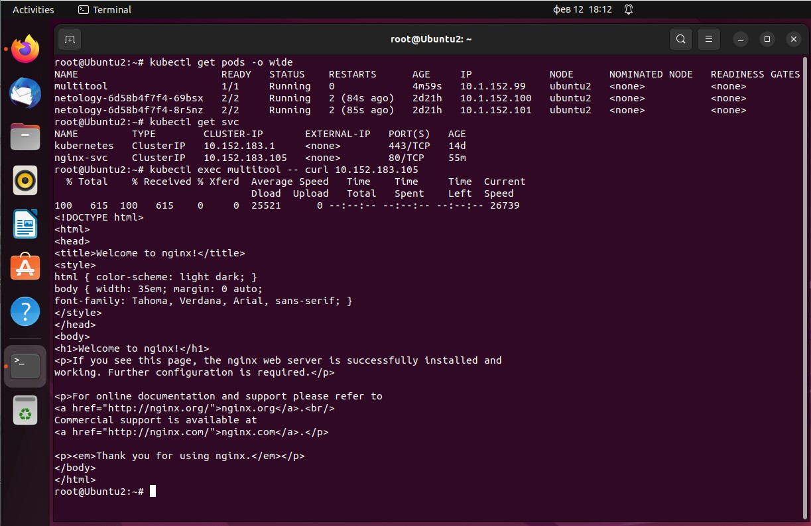

### Задание 2. Создать Deployment и обеспечить доступ к репликам приложения из другого Pod'а" ###

#### Создать Deployment приложения nginx и обеспечить старт контейнера только после того, как будет запущен сервис этого приложения ####

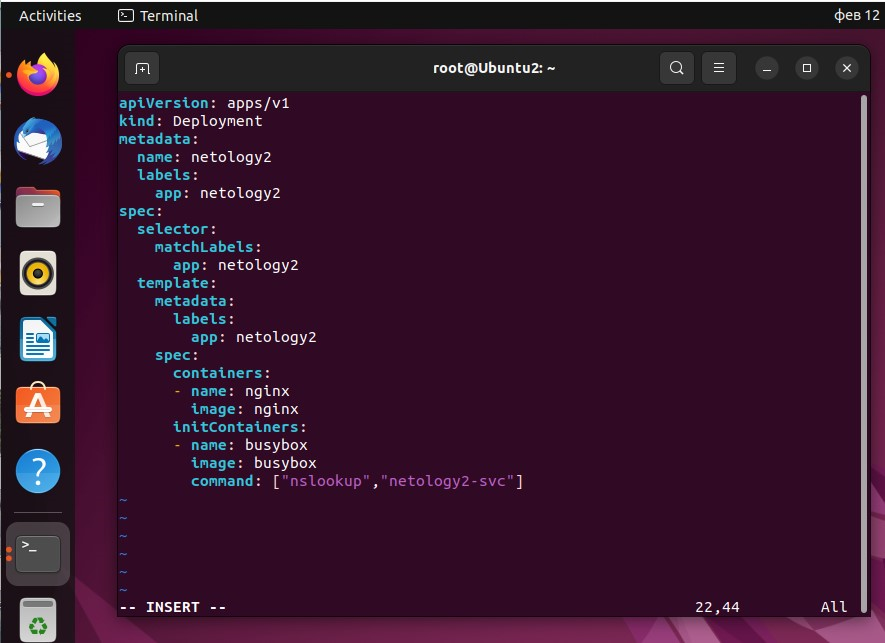

#### Убедиться, что nginx не стартует. В качестве init-контейнера взять busybox ####

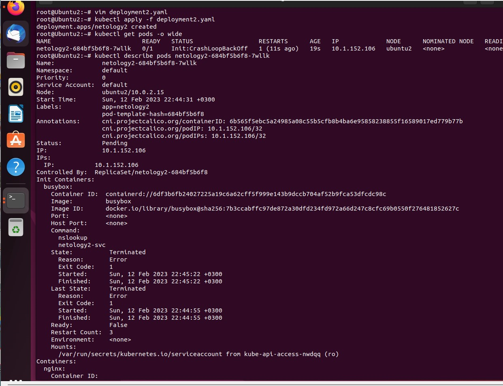

#### Создать и запустить Service. Убедиться, что nginx запустился ####

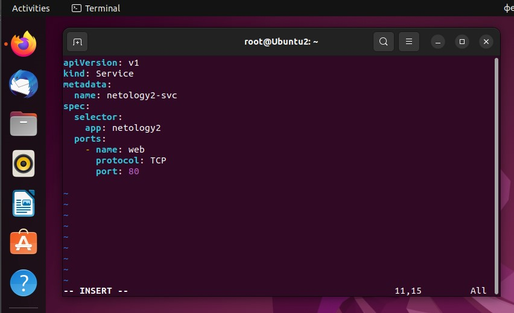

К сожалению не удалось добиться поднятия пода. Через "nslookup netology2-svc" не удаётся зарезолвить сервис. Вероятно потому, что он не создался полностью - ep не присваивается ip-адрес пода, так как под не поднялся
Получается какой-то замкнутый круг. Не удалось решить. Нужна Ваша подсказка.
