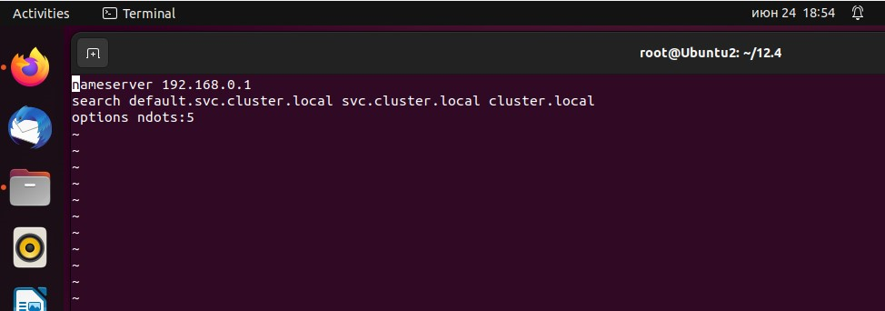

# Домашнее задание к занятию «Сетевое взаимодействие в K8S. Часть 1» #
#

### Задание 1. Создать Deployment и обеспечить доступ к контейнерам приложения по разным портам из другого Pod внутри кластера ###

#### 1. Создать Deployment приложения, состоящего из двух контейнеров (nginx и multitool), с количеством реплик 3 шт. ####

#### 2. Создать Service, который обеспечит доступ внутри кластера до контейнеров приложения из п.1 по порту 9001 — nginx 80, по 9002 — multitool 8080. ####

#### 3. Создать отдельный Pod с приложением multitool и убедиться с помощью curl, что из пода есть доступ до приложения из п.1 по разным портам в разные контейнеры. ####

#### 4. Продемонстрировать доступ с помощью curl по доменному имени сервиса. ####

К сожалению, доступ по именам почему-то не работает. 

Пробовал добавлять в /etc/resolv.conf опции согласно документации https://kubernetes.io/docs/concepts/services-networking/dns-pod-service/
но не помогает 

#

### Задание 2. Создать Service и обеспечить доступ к приложениям снаружи кластера ###

#### 1. Создать отдельный Service приложения из Задания 1 с возможностью доступа снаружи кластера к nginx, используя тип NodePort ####

#### 2. Продемонстрировать доступ с помощью браузера или curl с локального компьютера. ####

