# Домашнее задание к занятию «Сетевое взаимодействие в K8S. Часть 2» #

### Задание 1. Создать Deployment приложений backend и frontend ###

#### 1. Создать Deployment приложения frontend из образа nginx с количеством реплик 3 шт. ####

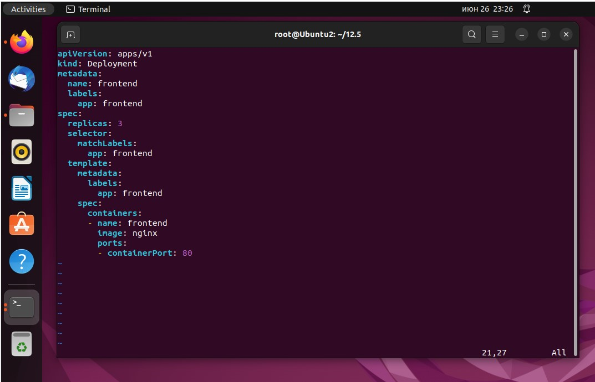

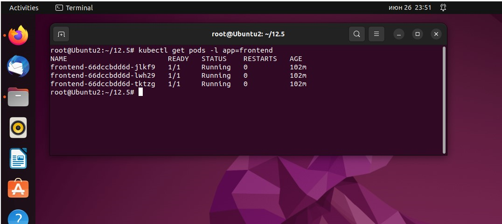

#### 2. Создать Deployment приложения backend из образа multitool. ####

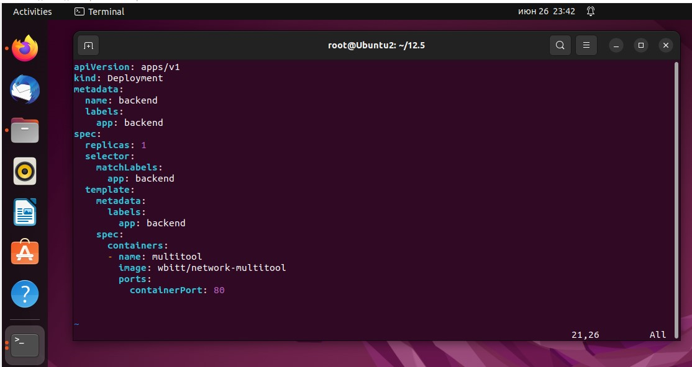

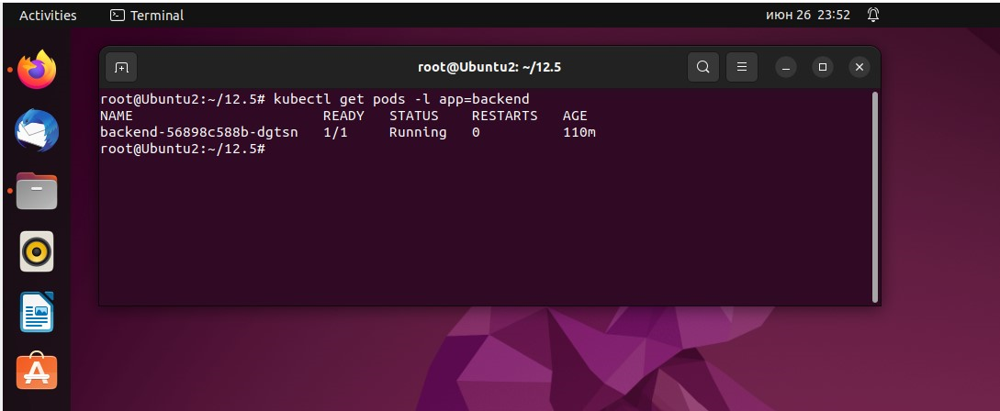

#### 3. Добавить Service, которые обеспечат доступ к обоим приложениям внутри кластера. ####

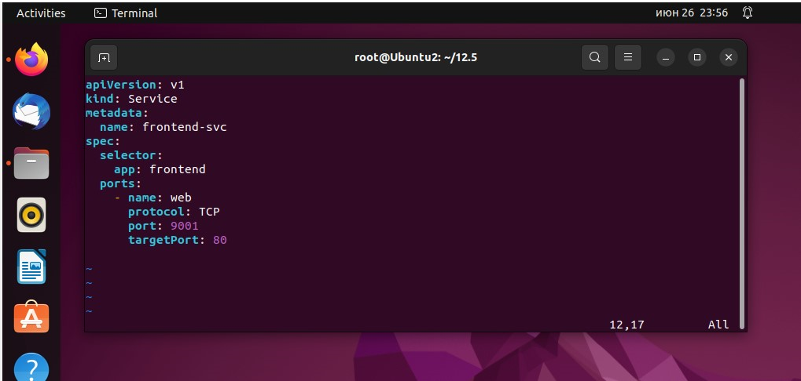

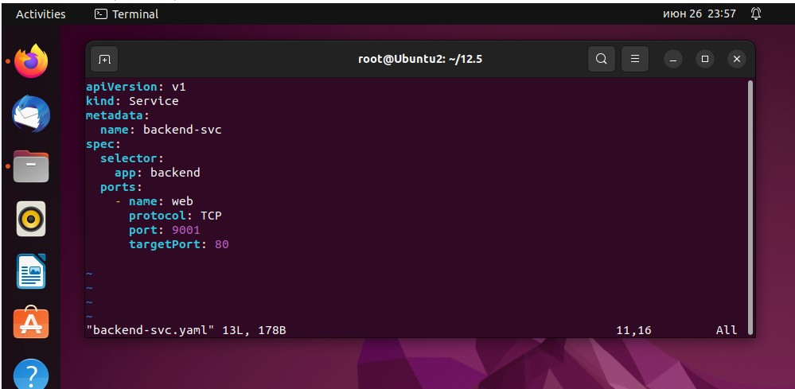

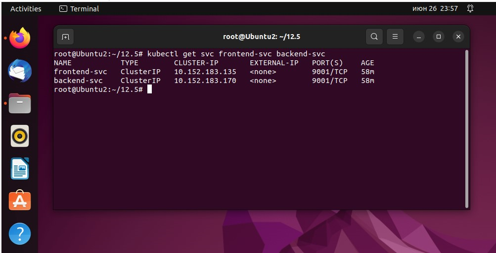

#### 4. Продемонстрировать, что приложения видят друг друга с помощью Service. ####

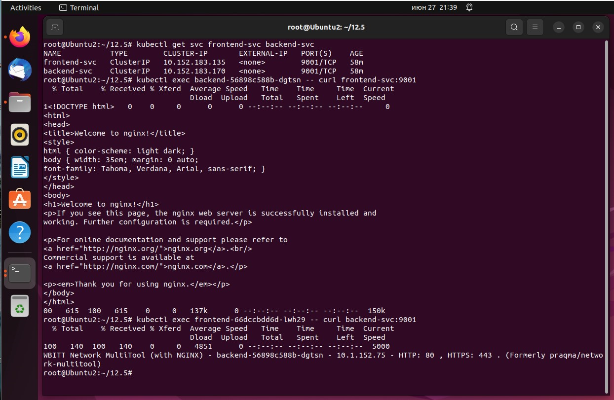

#

### Задание 2. Создать Ingress и обеспечить доступ к приложениям снаружи кластера  ###

#### 1. Включить Ingress-controller в MicroK8S. ####

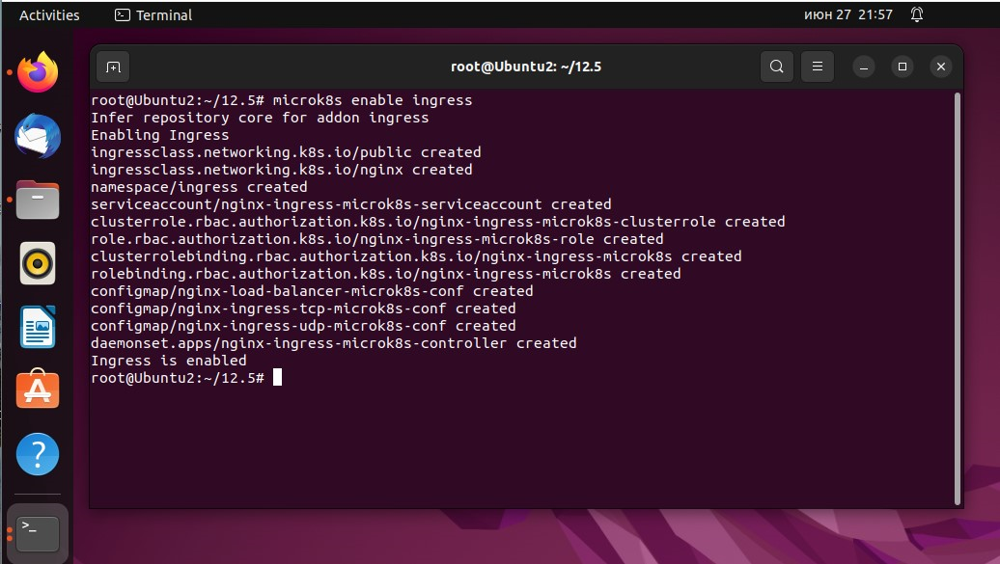

#### 2. Создать Ingress, обеспечивающий доступ снаружи по IP-адресу кластера MicroK8S так, чтобы при запросе только по адресу открывался frontend а при добавлении /api - backend. ####

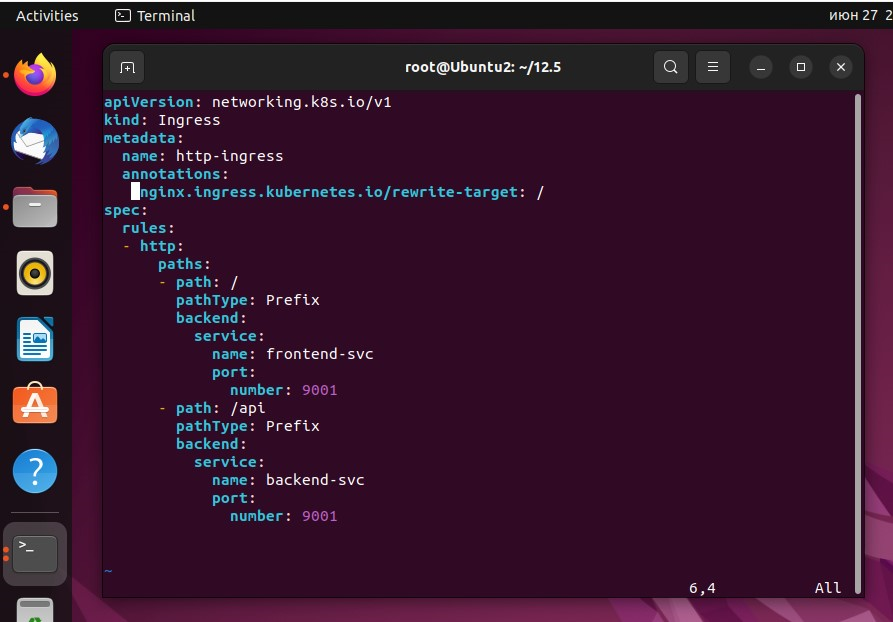

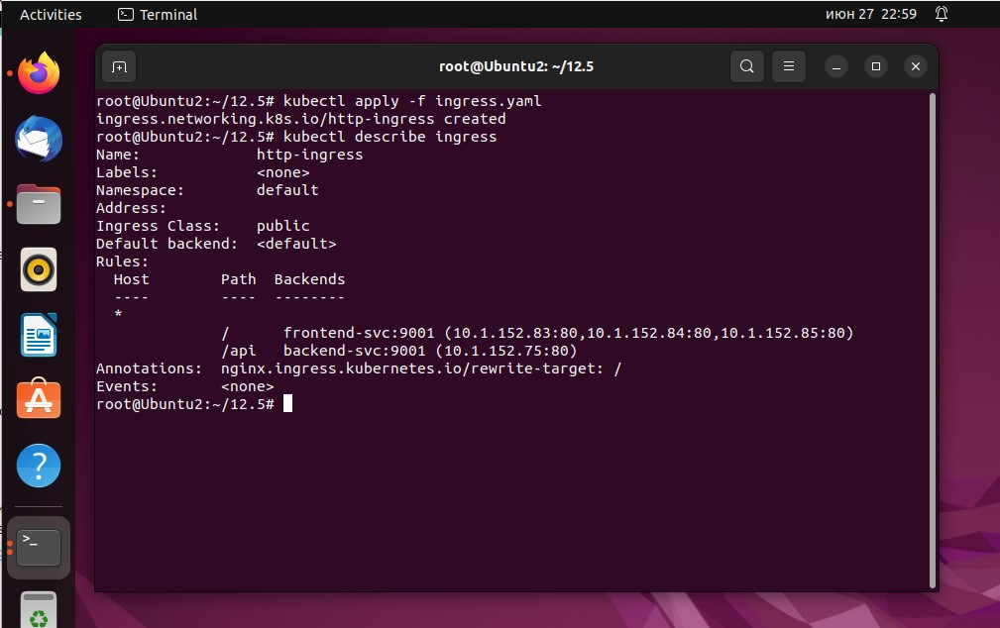

#### 3. Продемонстрировать доступ с помощью браузера или curl с локального компьютера. ####

Из предыдущего скриншота видно , что ингрессу почему-то не назначается адрес и как следствие он не работает, хотя сервисы указаны корректно. Найти причину не удаётся   

