# Домашнее задание к занятию «Установка Kubernetes» #

## Задание 1. Установить кластер k8s с 1 master node ##

Сначала попробовал установить через kubeadm 

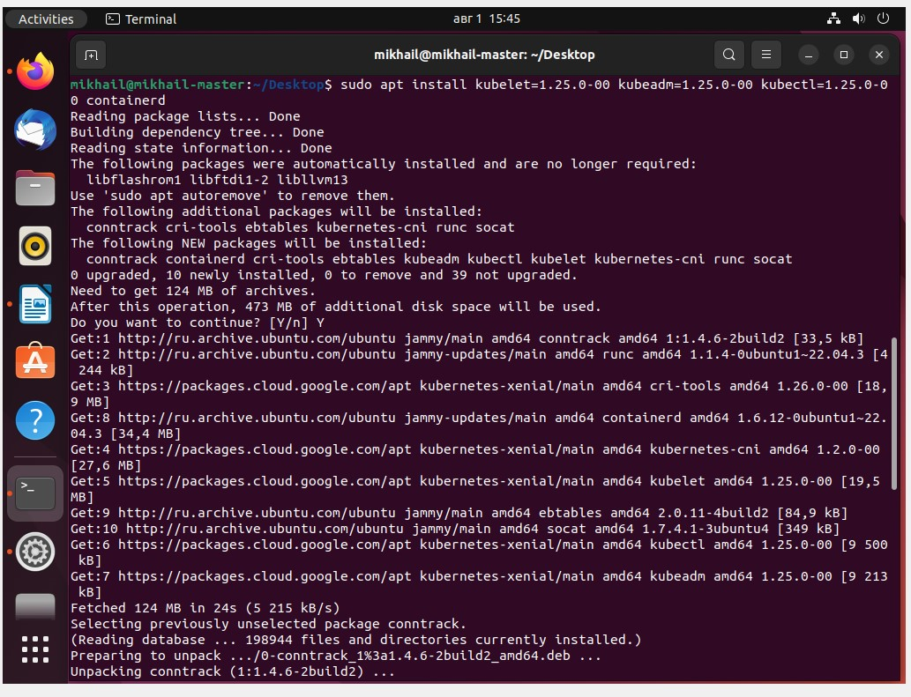

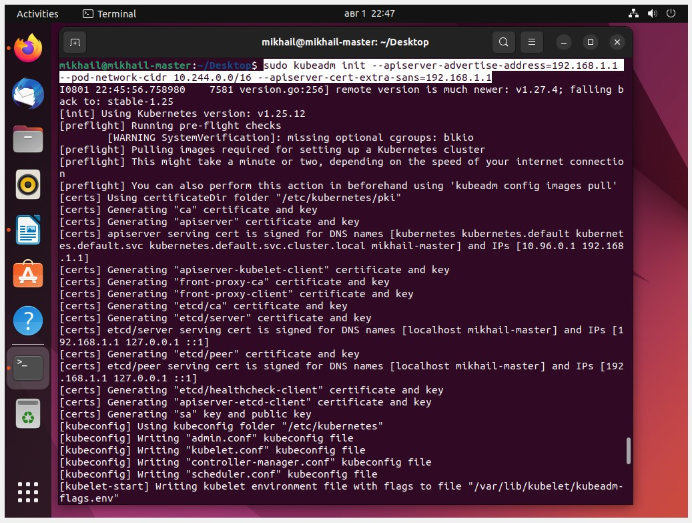

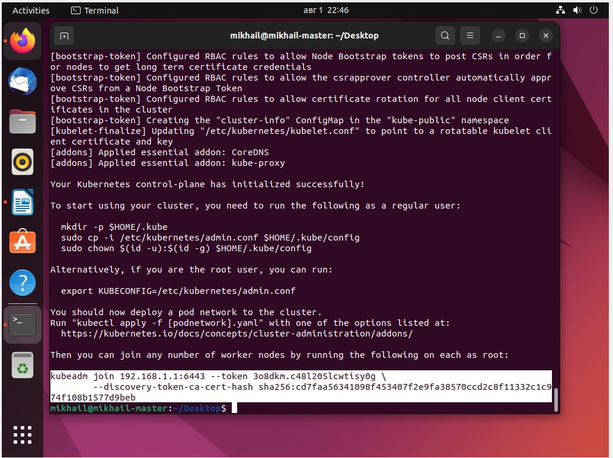

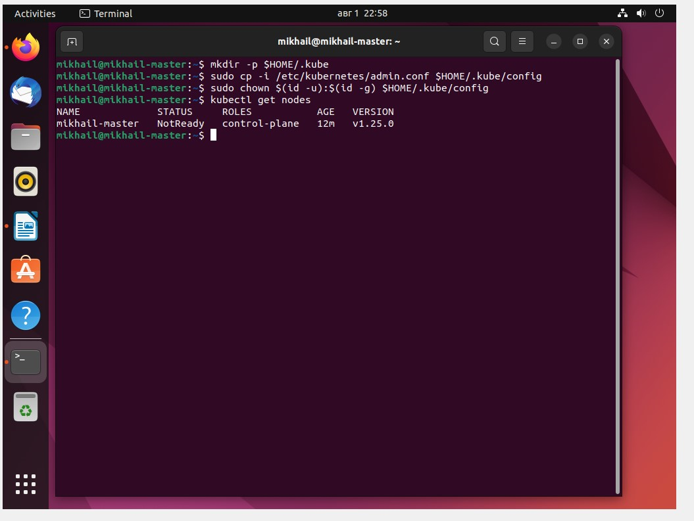

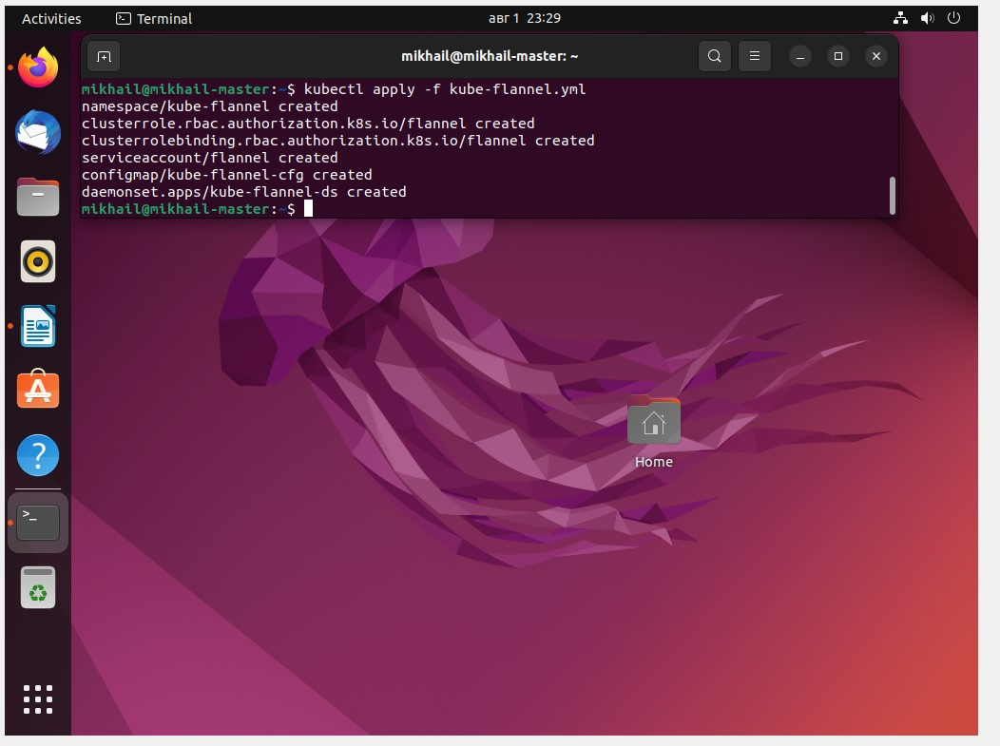

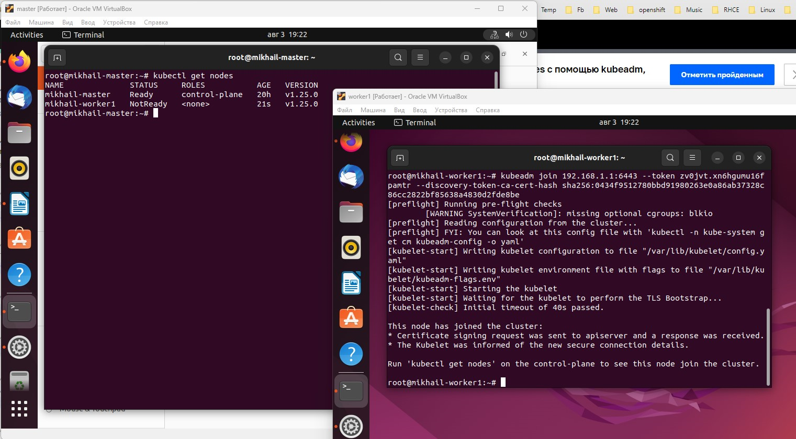

Но добиться того, чтобы worker'ы стали Ready, не удалось. На мастере также служба kubelet постоянно отваливается (connection refused). 
В общем, ситуация примерно такая же, как была на лекции, поэтому попробовал также через kubespray

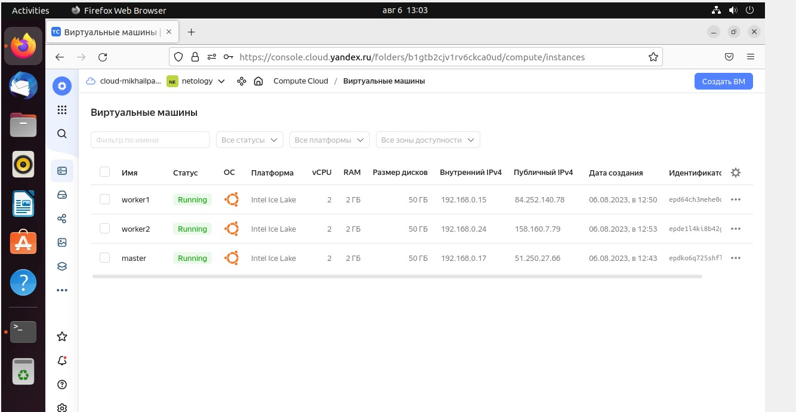

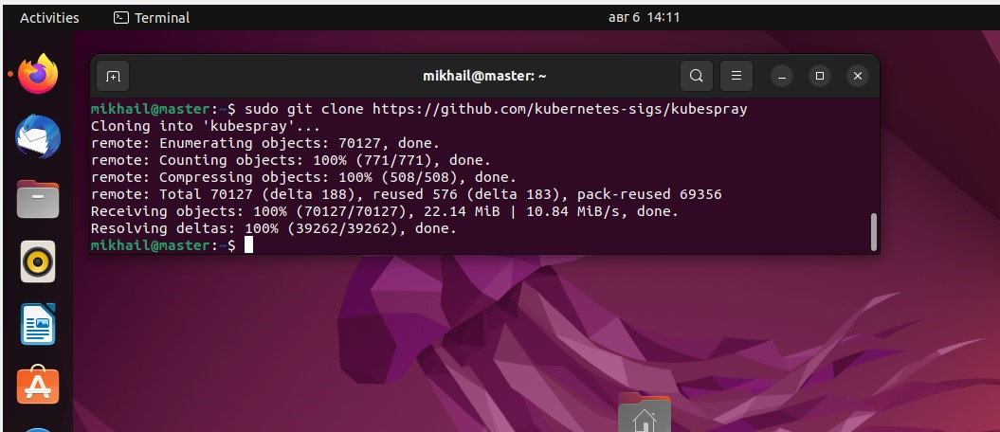

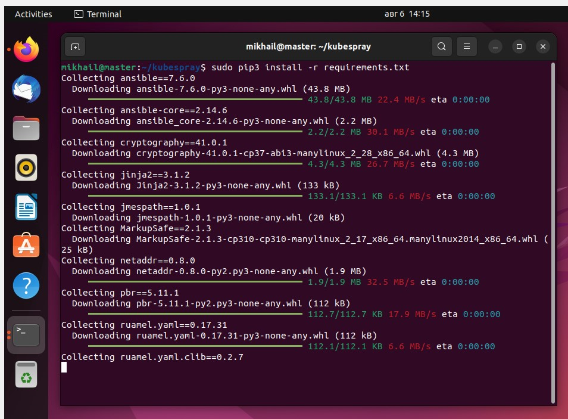

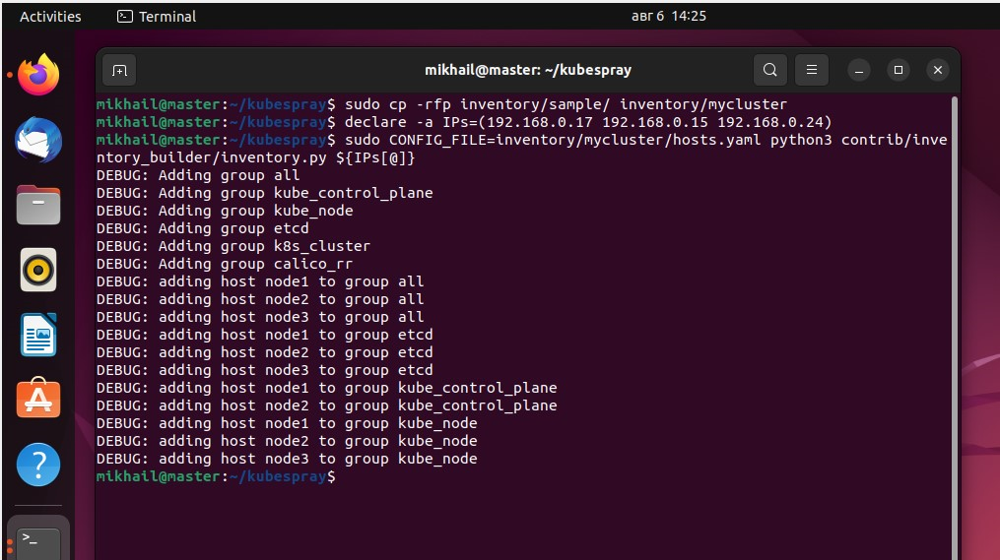

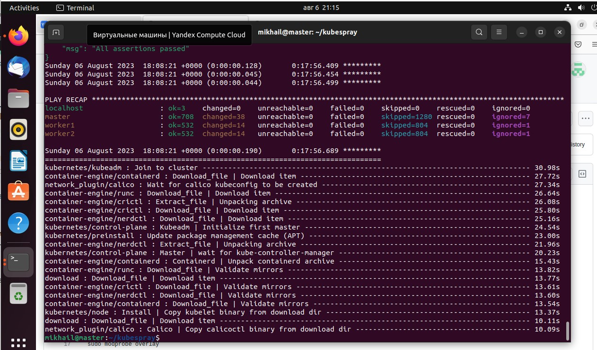

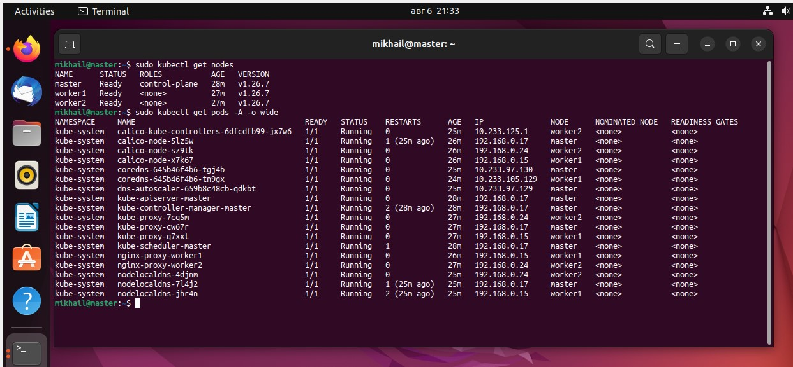

