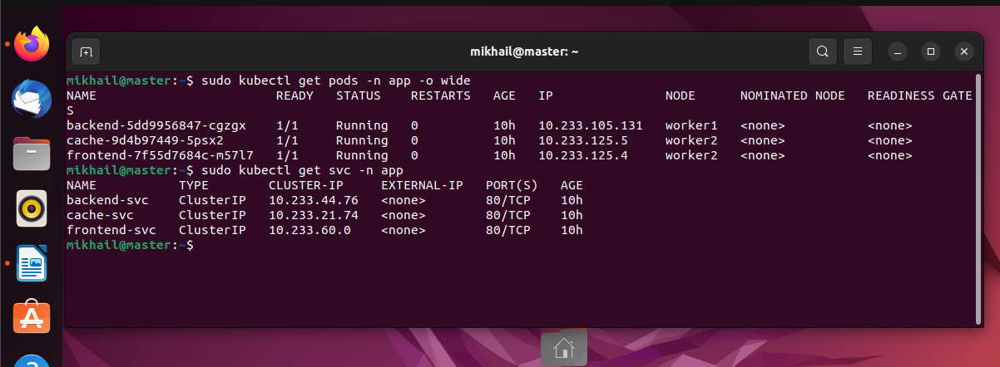

# Домашнее задание к занятию «Как работает сеть в K8s» #

## Задание 1. Создать сетевую политику или несколько политик для обеспечения доступа ##

#### 1. Создать deployment'ы приложений frontend, backend и cache и соответсвующие сервисы. ####
#### 2. В качестве образа использовать network-multitool. ####
#### 3. Разместить поды в namespace App. ####

Проверяем, что доступ есть

#### 4. Создать политики, чтобы обеспечить доступ frontend -> backend -> cache. Другие виды подключений должны быть запрещены. ####
#### 5. Продемонстрировать, что трафик разрешён и запрещён ####

Политика для Frontend

Применяем политику и проверяем , что доступ пропал

Политика для backend

Применяем политику и видим что доступ с пода cache пропал

а с пода frontend доступ есть 

Для cache политика аналогичная backend

