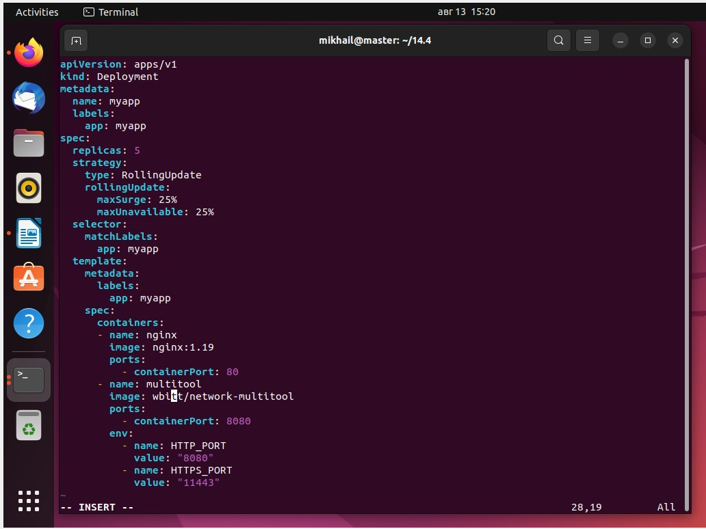
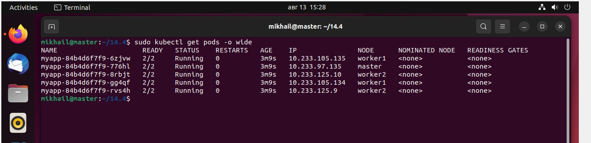
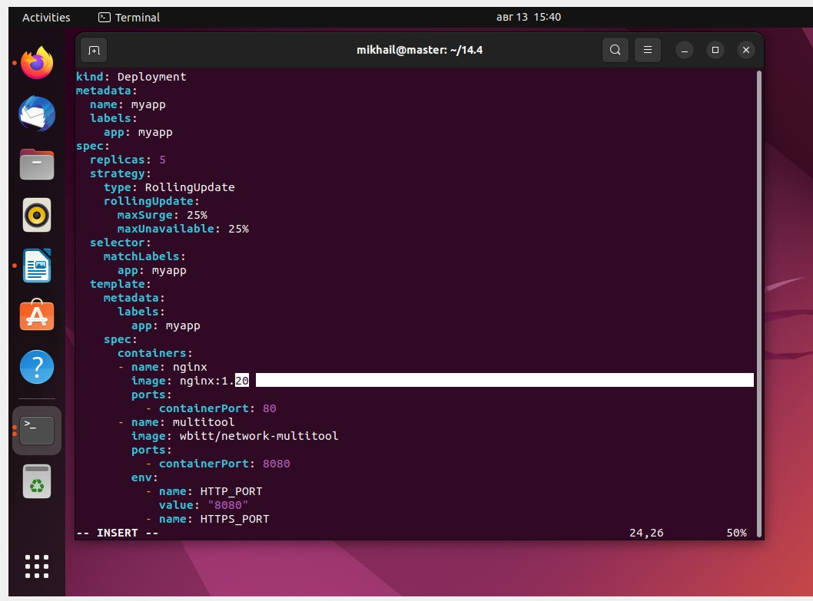
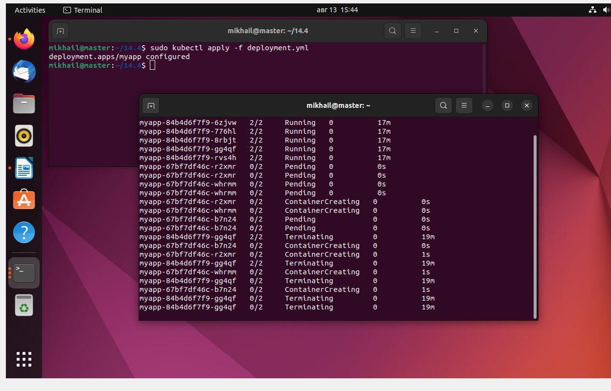
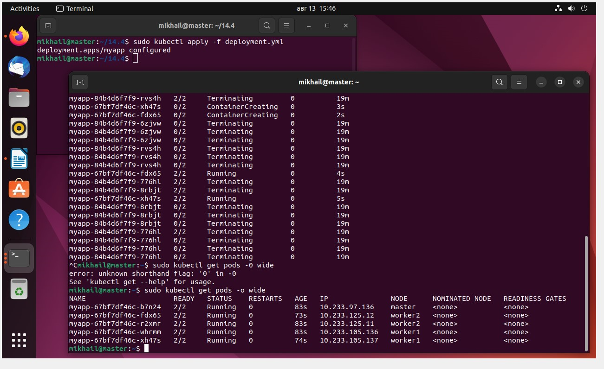
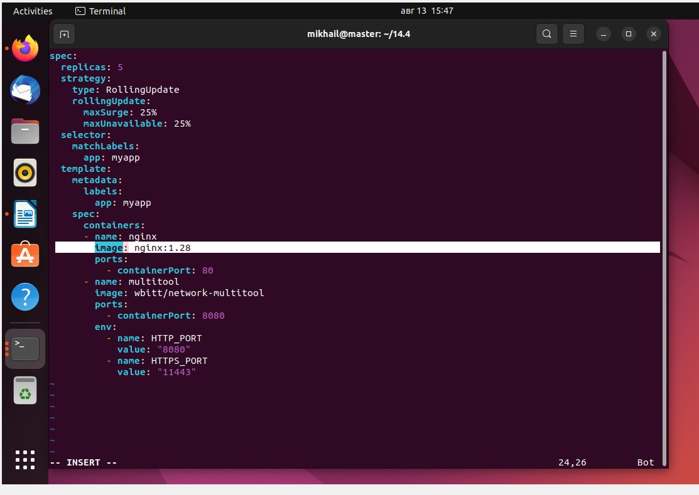
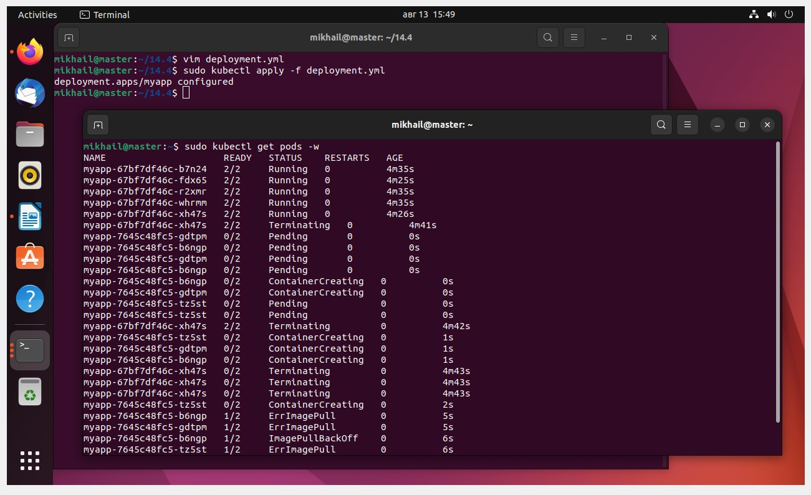
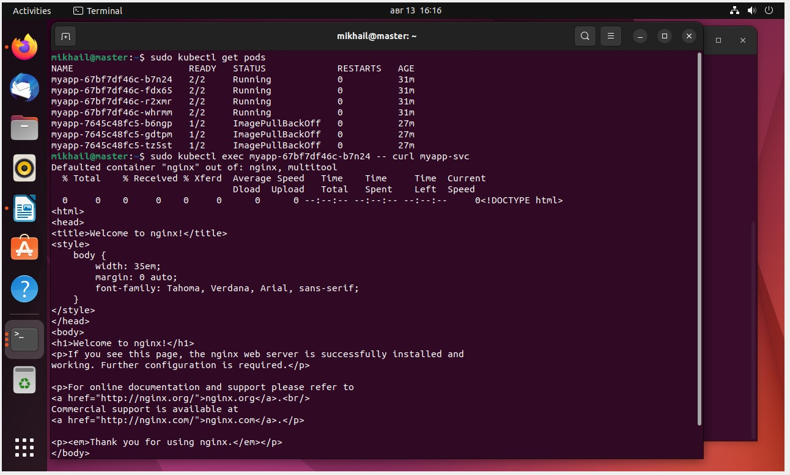
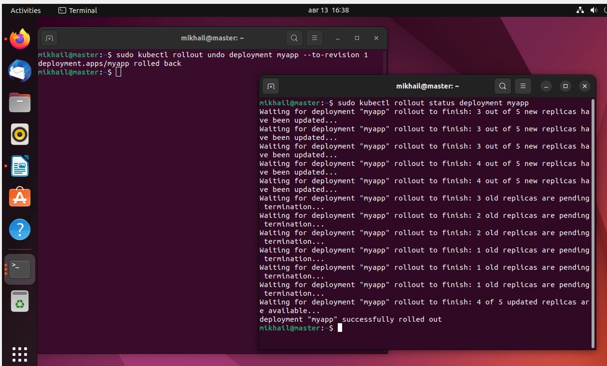

# Домашнее задание к занятию «Обновление приложений» #

## Задание 1. Выбрать стратегию обновления приложения и описать ваш выбор ##

#### 1.Имеется приложение, состоящее из нескольких реплик, которое требуется обновить. ####
#### 2.Ресурсы, выделенные для приложения, ограничены, и нет возможности их увеличить. ####
#### 3.Запас по ресурсам в менее загруженный момент времени составляет 20%. ####
#### 4.Обновление мажорное, новые версии приложения не умеют работать со старыми. ####
#### 5.Вам нужно объяснить свой выбор стратегии обновления приложения. #### 

Так как новые версии не умеют работать со старыми и ресурсы ограничены, то не получится реализовать blue/green и canary.
rolling update можно релизовать, только если число реплик большое, т.е. и каждая реплика использует заметно меньше ресурсов, чем тот запас в 20%
Наиболее реалистичным является вариант "Recreate" 

## Задание 2. Обновить приложение ##

#### 1. Создать deployment приложения с контейнерами nginx и multitool. Версию nginx взять 1.19. Количество реплик — 5. ####

#### 2.Обновить версию nginx в приложении до версии 1.20, сократив время обновления до минимума. Приложение должно быть доступно. ####

#### 3. Попытаться обновить nginx до версии 1.28, приложение должно оставаться доступным. ####

При этом приложение доступно

#### 4. Откатиться после неудачного обновления. ####

