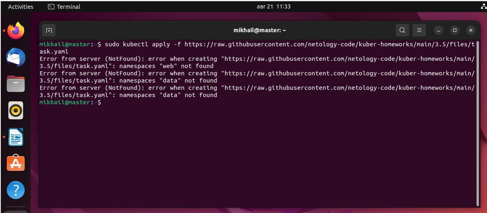
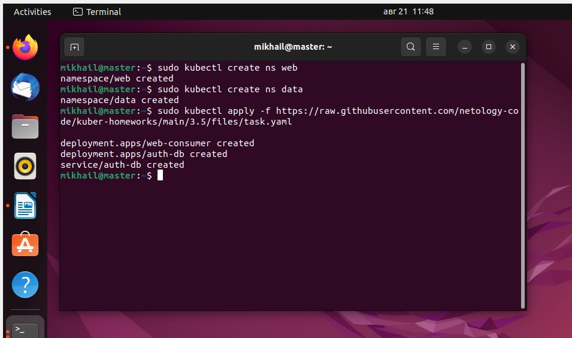
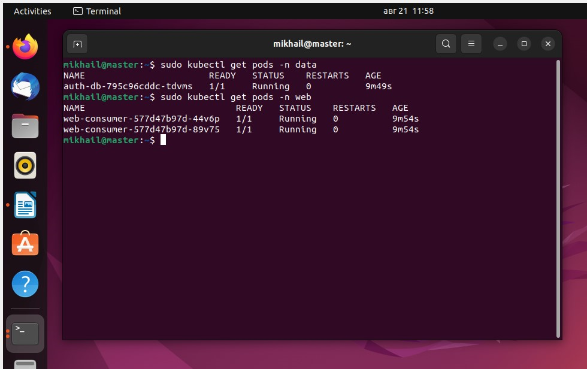
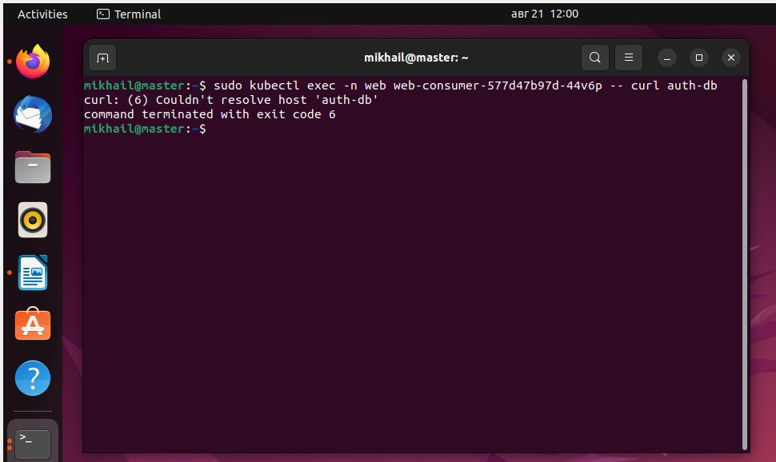
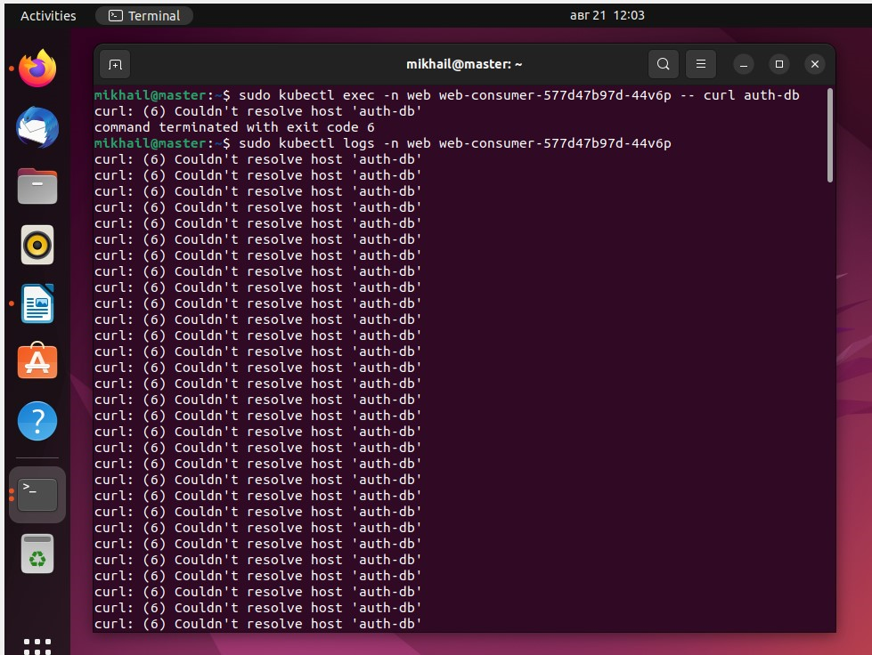
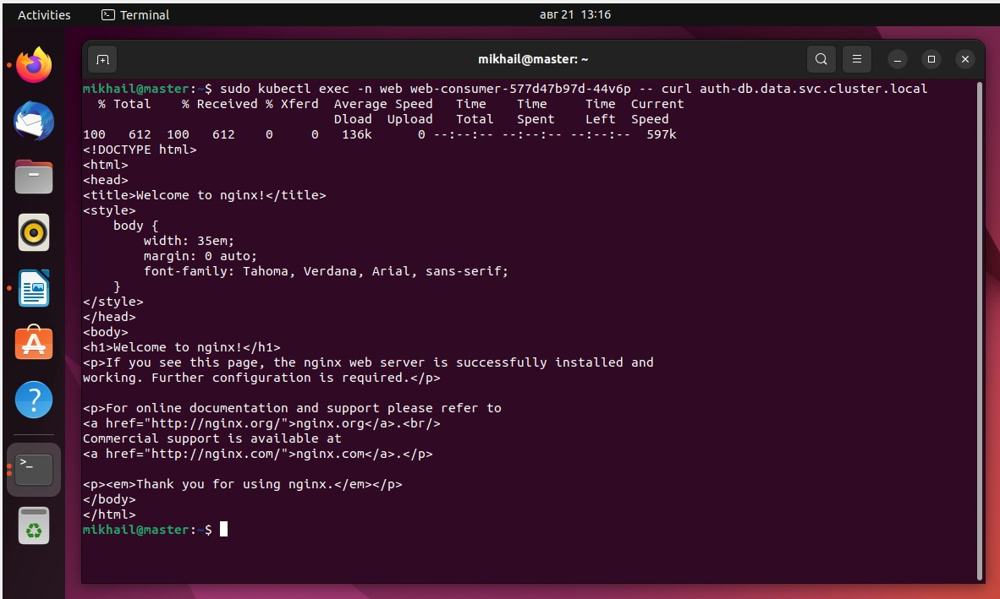
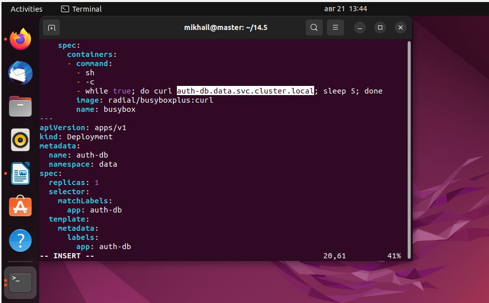
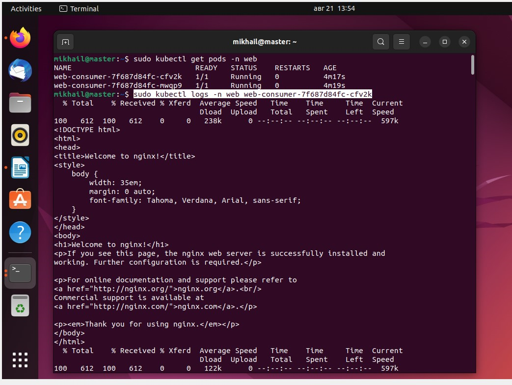

# Домашнее задание к занятию «Troubleshooting» #

## Задание 1. При деплое приложение web-consumer не может подключиться к auth-db. Необходимо это исправить ##

#### 1. Установить приложение по команде ####

 ```kubectl apply -f https://raw.githubusercontent.com/netology-code/kuber-homeworks/main/3.5/files/task.yaml```



Отсутствуют неймспейсы web и data, указанные в манифесте. Создаём их 



#### 2. Выявить проблему и описать. ####

Проверяем, поднялись ли поды



Поднялись

Проверяем подключение 



Смотрим логи пода 



в логах ошибка разрешения имени сервиса, так как указано неполное имя. По полному имени подключение есть



#### 3. Исправить проблему, описать, что сделано. ####

Указываем полное имя сервиса в описании деплоймента



#### 4. Продемонстрировать, что проблема решена. ####

Смотрим логи пода - ошибок больше нет




