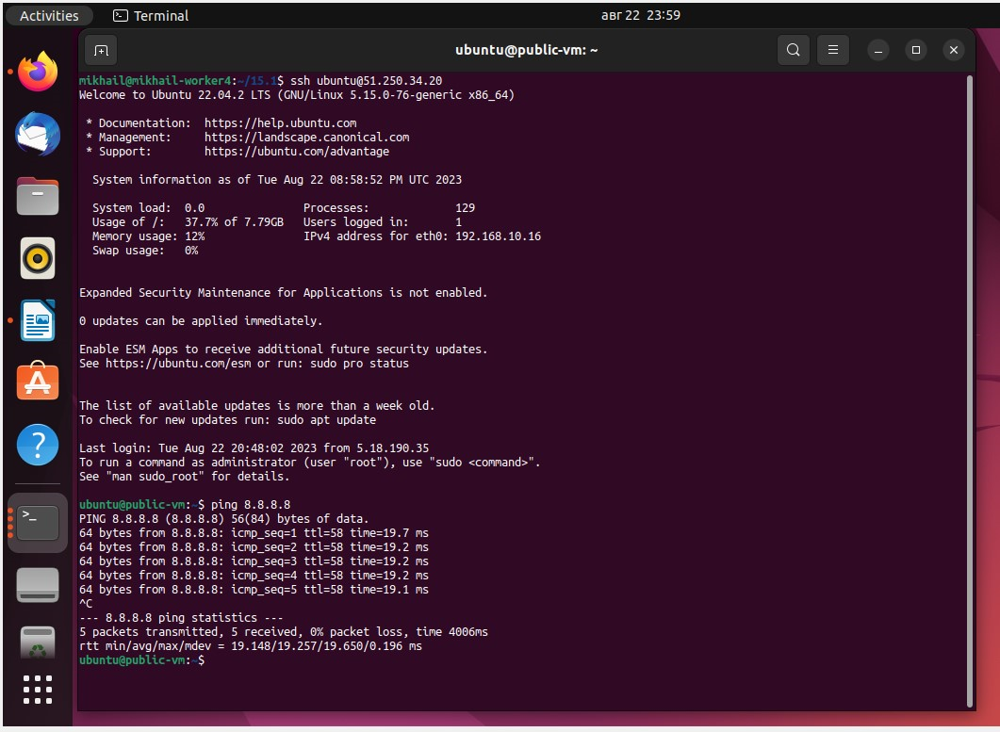

# Домашнее задание к занятию «Организация сети» #

## Задание 1. Yandex Cloud ##

**Что нужно сделать**

1. Создать пустую VPC. Выбрать зону.
2. Публичная подсеть.

 - Создать в VPC subnet с названием public, сетью 192.168.10.0/24.
 - Создать в этой подсети NAT-инстанс, присвоив ему адрес 192.168.10.254. В качестве image_id использовать fd80mrhj8fl2oe87o4e1.
 - Создать в этой публичной подсети виртуалку с публичным IP, подключиться к ней и убедиться, что есть доступ к интернету.
3. Приватная подсеть.
 - Создать в VPC subnet с названием private, сетью 192.168.20.0/24.
 - Создать route table. Добавить статический маршрут, направляющий весь исходящий трафик private сети в NAT-инстанс.
 - Создать в этой приватной подсети виртуалку с внутренним IP, подключиться к ней через виртуалку, созданную ранее, и убедиться, что есть доступ к интернету.

### Решение ###

Устанавливаем и настраиваем утилиту yc

Устанавливаем и настраиваем terraform

Создаём переменные и описываем их в файле variables.tf  https://github.com/MikhailPastushenko/devops-netology3/blob/main/15.1/variables.tf

Описываем провайдер yandex в файле provider.tf https://github.com/MikhailPastushenko/devops-netology3/blob/main/15.1/provider.tf

В файле main.tf описываем ресурсы https://github.com/MikhailPastushenko/devops-netology3/blob/main/15.1/main.tf

Результат `terraform plan`

Результат `terraform apply`

Созданные ресурсы

Подключаемся к ВМ с публичным IP и проверяем наличие интернета 

Подключиться к ВМ с внутренним IP через ВМ с публичным, к сожалению, не удалось, так как ключ на неё копировался с другой машины (соединение не разрешено), а сгенерить и скопировать ещё один ключ невозможно, так как в ЯндексОблаке на всех ВМ по умолчанию отключен вход ssh по паролю (ssh-copy-id выдаёт ошибку) 

