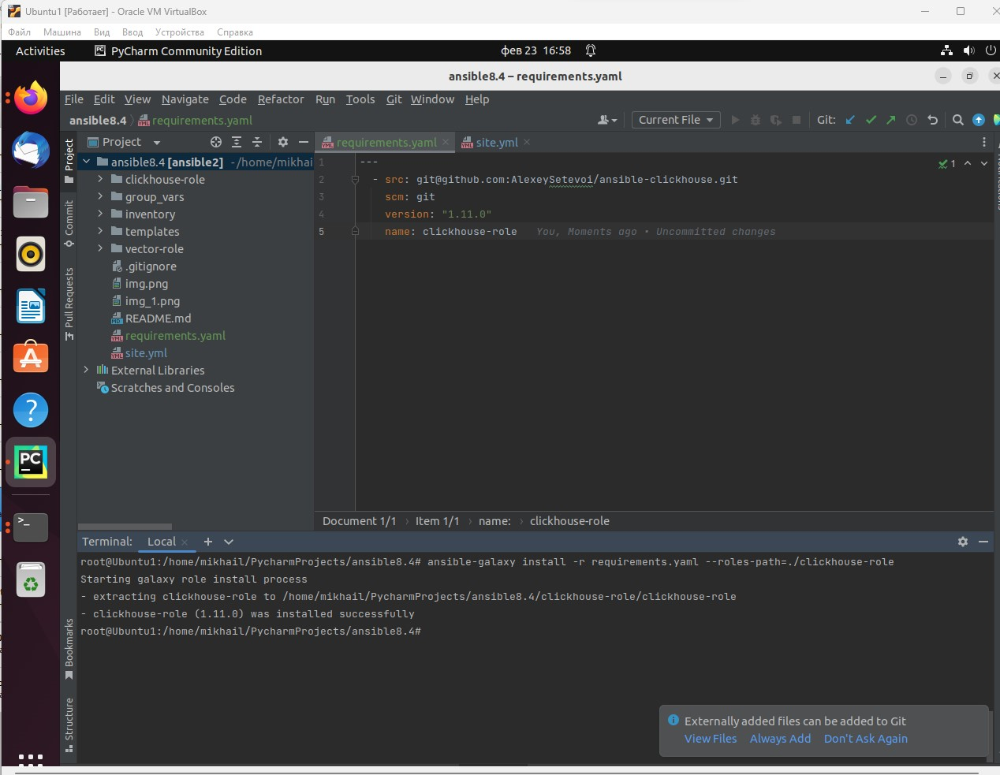
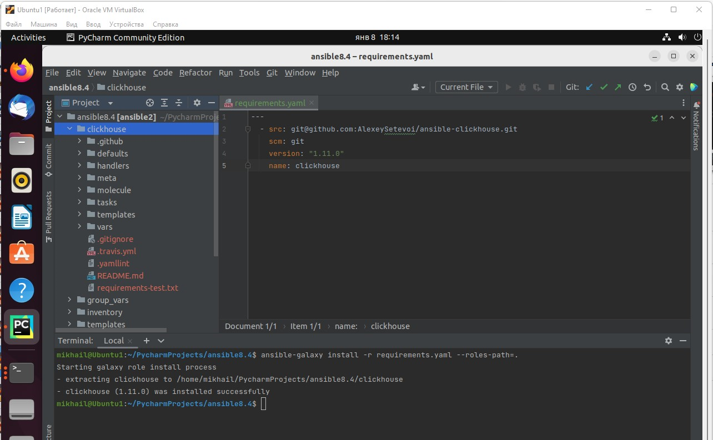
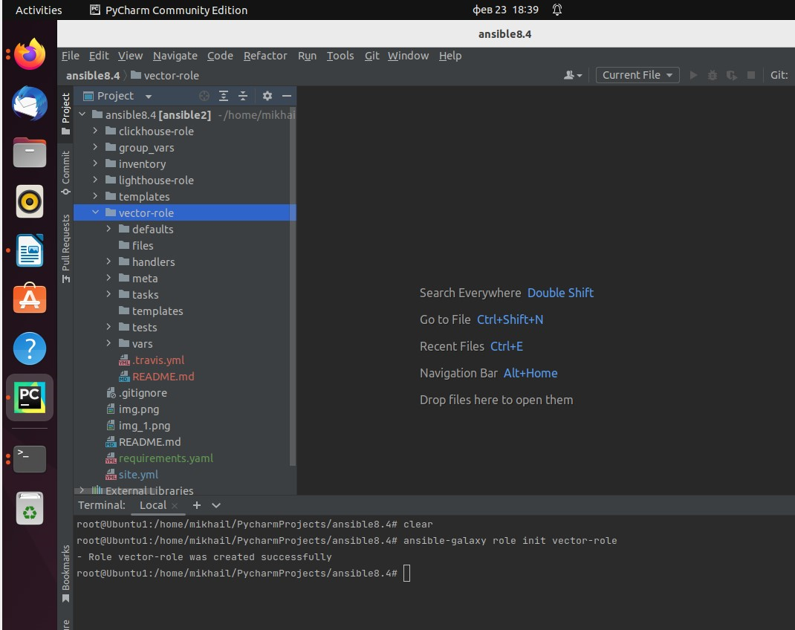
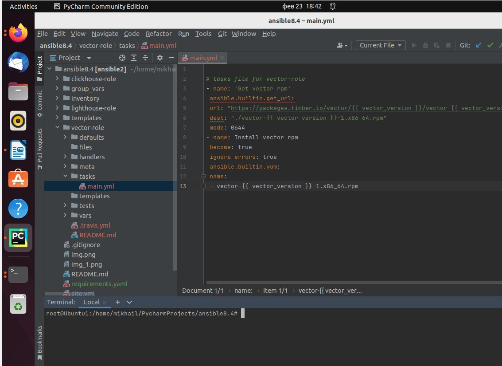
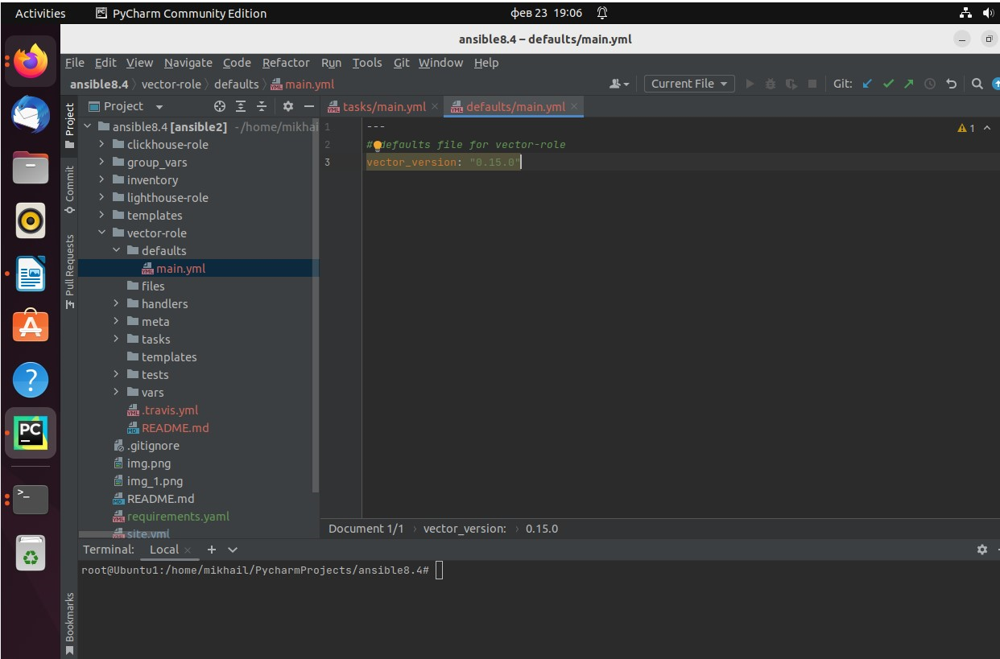
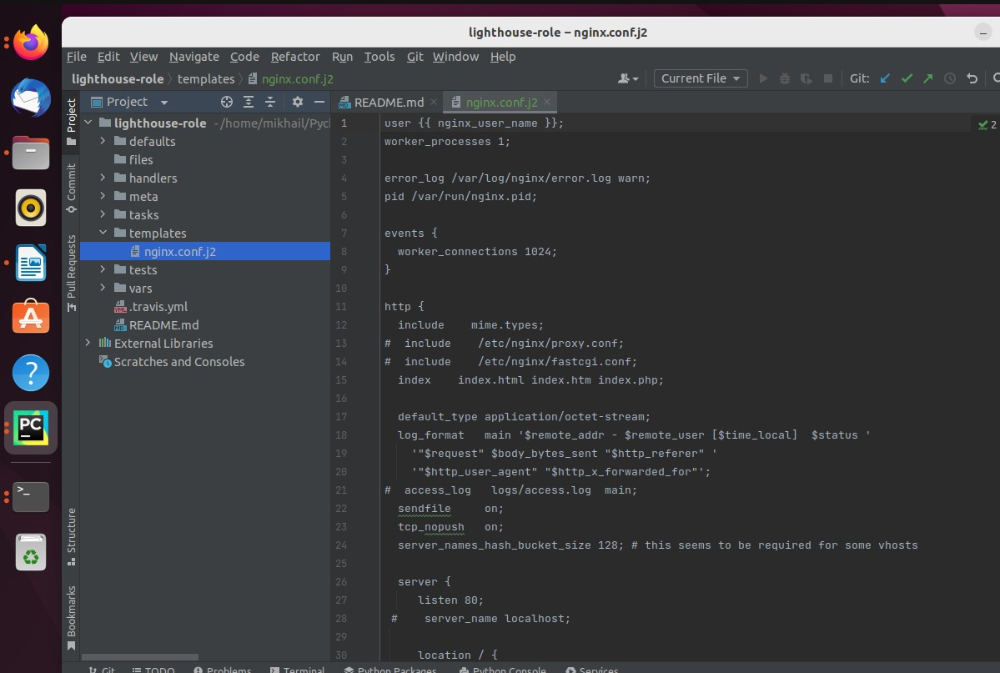
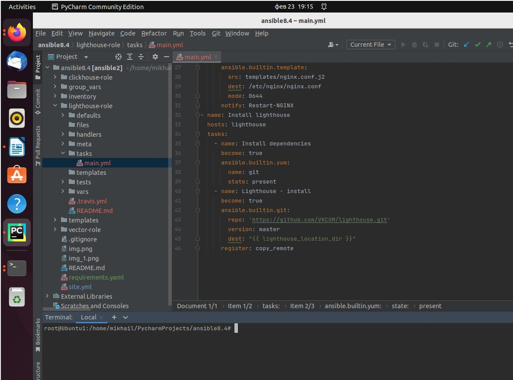
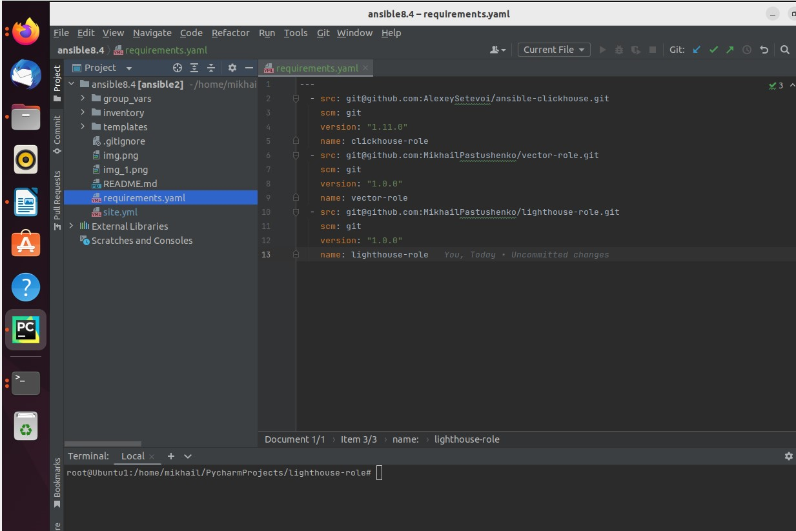
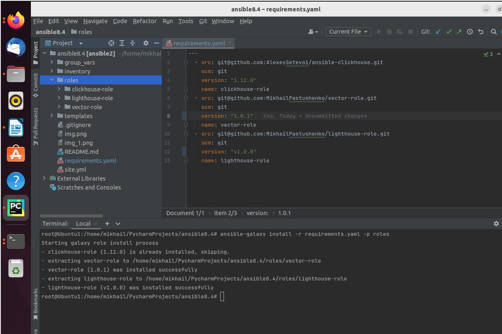

## Домашнее задание к занятию "4. Работа с roles" ##

#### 1. Создать в старой версии playbook файл requirements.yml и заполнить его следующим содержимым: ####

#### 2. При помощи ansible-galaxy скачать себе эту роль. ####

#### 3. Создать новый каталог с ролью при помощи ansible-galaxy role init vector-role ####

#### 4. На основе tasks из старого playbook заполните новую role. Разнесите переменные между vars и default ####

#### 5. Перенести нужные шаблоны конфигов в templates ####

#### 6. Описать в README.md обе роли и их параметры. ####

https://github.com/MikhailPastushenko/vector-role/blob/main/README.md

https://github.com/MikhailPastushenko/lighthouse-role/blob/main/README.md

#### 7. Повторите шаги 3-6 для lighthouse. Помните, что одна роль должна настраивать один продукт. ####

##### 9. Переработайте playbook на использование roles. Не забудьте про зависимости lighthouse и возможности совмещения roles с tasks ####

#### 10. Выложите playbook в репозиторий. ####
#### 11. В ответ приведите ссылки на оба репозитория с roles и одну ссылку на репозиторий с playbook ####

https://github.com/MikhailPastushenko/vector-role

https://github.com/MikhailPastushenko/lighthouse-role

https://github.com/MikhailPastushenko/ansible8.4
