## Домашнее задание к занятию 5 «Тестирование roles» ##

#### 1. Установите molecule: pip3 install "molecule==3.5.2" ####

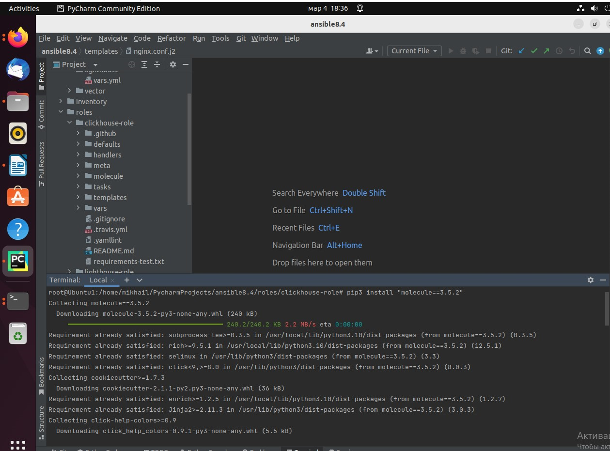

#### 2. Выполните docker pull aragast/netology:latest — это образ с podman, tox и несколькими пайтонами (3.7 и 3.9) внутри. ####

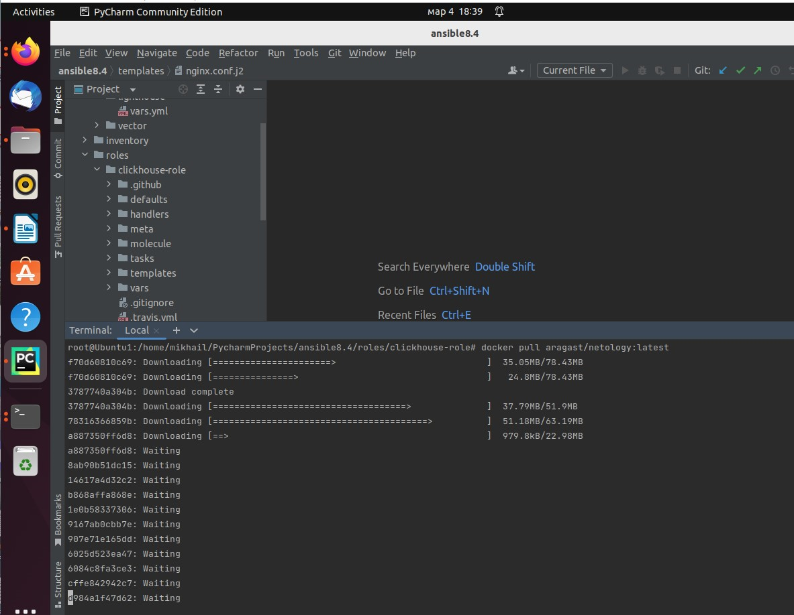

### Molecule ###

#### 1. Запустите molecule test -s centos_7 внутри корневой директории clickhouse-role, посмотрите на вывод команды. Данная команда может отработать с ошибками, это нормально. Наша цель - посмотреть как другие в реальном мире используют молекулу. ####

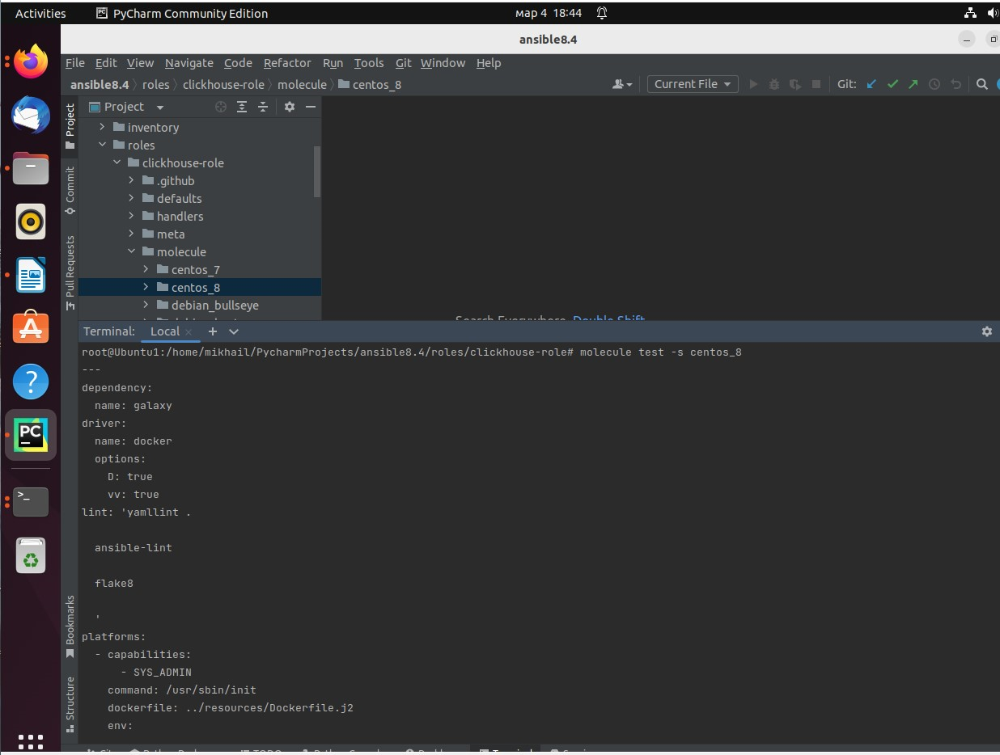

#### 2. Перейдите в каталог с ролью vector-role и создайте сценарий тестирования по умолчанию при помощи molecule init scenario --driver-name docker ####

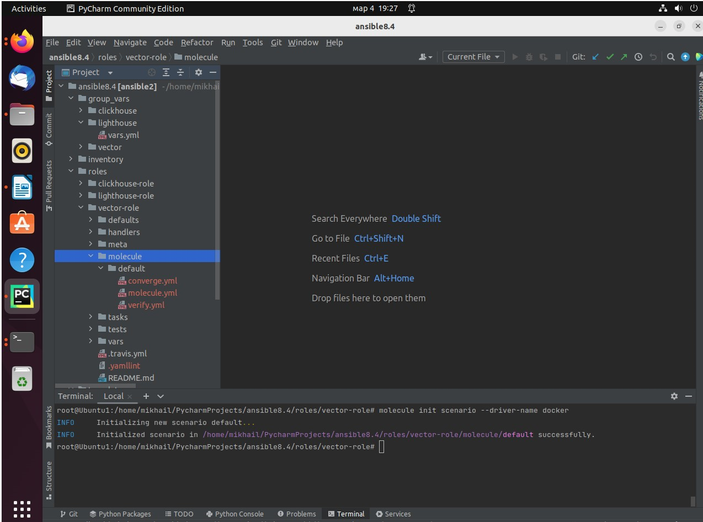

#### 3. Добавьте несколько разных дистрибутивов (centos:8, ubuntu:latest) для инстансов и протестируйте роль, исправьте найденные ошибки, если они есть. ####

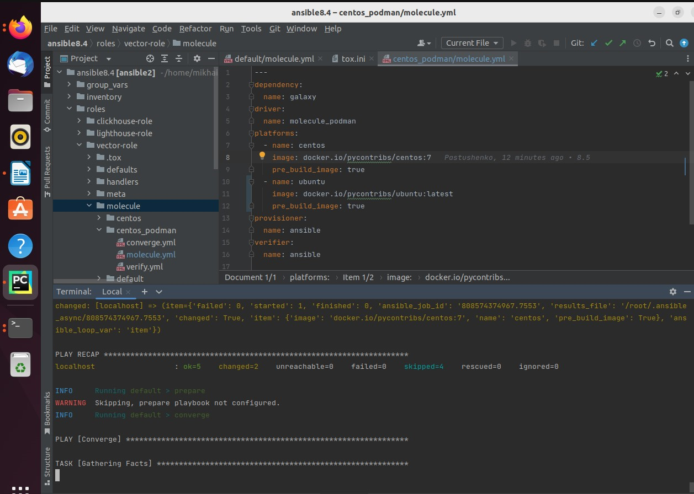

```
root@Ubuntu1:/home/mikhail/PycharmProjects/ansible8.4/roles/vector-role# molecule test
INFO     default scenario test matrix: dependency, lint, cleanup, destroy, syntax, create, prepare, converge, idempotence, side_effect, verify, cleanup, destroy
INFO     Performing prerun...
INFO     Set ANSIBLE_LIBRARY=/root/.cache/ansible-compat/f5bcd7/modules:/root/.ansible/plugins/modules:/usr/share/ansible/plugins/modules
INFO     Set ANSIBLE_COLLECTIONS_PATH=/root/.cache/ansible-compat/f5bcd7/collections:/root/.ansible/collections:/usr/share/ansible/collections
INFO     Set ANSIBLE_ROLES_PATH=/root/.cache/ansible-compat/f5bcd7/roles:/root/.ansible/roles:/usr/share/ansible/roles:/etc/ansible/roles
INFO     Running default > dependency
WARNING  Skipping, missing the requirements file.
WARNING  Skipping, missing the requirements file.
INFO     Running default > lint
INFO     Lint is disabled.
INFO     Running default > cleanup
WARNING  Skipping, cleanup playbook not configured.
INFO     Running default > destroy
INFO     Sanity checks: 'docker'

PLAY [Destroy] *****************************************************************

TASK [Destroy molecule instance(s)] ********************************************
changed: [localhost] => (item=centos)
changed: [localhost] => (item=ubuntu)

TASK [Wait for instance(s) deletion to complete] *******************************
ok: [localhost] => (item=centos)
ok: [localhost] => (item=ubuntu)

TASK [Delete docker networks(s)] ***********************************************
skipping: [localhost]

PLAY RECAP *********************************************************************
localhost                  : ok=2    changed=1    unreachable=0    failed=0    skipped=1    rescued=0    ignored=0

INFO     Running default > syntax

playbook: /home/mikhail/PycharmProjects/ansible8.4/roles/vector-role/molecule/default/converge.yml
INFO     Running default > create

PLAY [Create] ******************************************************************

TASK [Log into a Docker registry] **********************************************
skipping: [localhost] => (item=None) 
skipping: [localhost] => (item=None) 
skipping: [localhost]

TASK [Check presence of custom Dockerfiles] ************************************
ok: [localhost] => (item={'image': 'docker.io/pycontribs/centos:7', 'name': 'centos', 'pre_build_image': True})
ok: [localhost] => (item={'image': 'docker.io/pycontribs/ubuntu:latest', 'name': 'ubuntu', 'pre_build_image': True})

TASK [Create Dockerfiles from image names] *************************************
skipping: [localhost] => (item={'image': 'docker.io/pycontribs/centos:7', 'name': 'centos', 'pre_build_image': True}) 
skipping: [localhost] => (item={'image': 'docker.io/pycontribs/ubuntu:latest', 'name': 'ubuntu', 'pre_build_image': True}) 
skipping: [localhost]

TASK [Discover local Docker images] ********************************************
ok: [localhost] => (item={'changed': False, 'skipped': True, 'skip_reason': 'Conditional result was False', 'item': {'image': 'docker.io/pycontribs/centos:7', 'name': 'centos', 'pre_build_image': True}, 'ansible_loop_var': 'item', 'i': 0, 'ansible_index_var': 'i'})
ok: [localhost] => (item={'changed': False, 'skipped': True, 'skip_reason': 'Conditional result was False', 'item': {'image': 'docker.io/pycontribs/ubuntu:latest', 'name': 'ubuntu', 'pre_build_image': True}, 'ansible_loop_var': 'item', 'i': 1, 'ansible_index_var': 'i'})

TASK [Build an Ansible compatible image (new)] *********************************
skipping: [localhost] => (item=molecule_local/docker.io/pycontribs/centos:7) 
skipping: [localhost] => (item=molecule_local/docker.io/pycontribs/ubuntu:latest) 
skipping: [localhost]

TASK [Create docker network(s)] ************************************************
skipping: [localhost]

TASK [Determine the CMD directives] ********************************************
ok: [localhost] => (item={'image': 'docker.io/pycontribs/centos:7', 'name': 'centos', 'pre_build_image': True})
ok: [localhost] => (item={'image': 'docker.io/pycontribs/ubuntu:latest', 'name': 'ubuntu', 'pre_build_image': True})

TASK [Create molecule instance(s)] *********************************************
changed: [localhost] => (item=centos)
changed: [localhost] => (item=ubuntu)

TASK [Wait for instance(s) creation to complete] *******************************
FAILED - RETRYING: [localhost]: Wait for instance(s) creation to complete (300 retries left).
FAILED - RETRYING: [localhost]: Wait for instance(s) creation to complete (299 retries left).
FAILED - RETRYING: [localhost]: Wait for instance(s) creation to complete (298 retries left).
FAILED - RETRYING: [localhost]: Wait for instance(s) creation to complete (297 retries left).
FAILED - RETRYING: [localhost]: Wait for instance(s) creation to complete (296 retries left).
FAILED - RETRYING: [localhost]: Wait for instance(s) creation to complete (295 retries left).
FAILED - RETRYING: [localhost]: Wait for instance(s) creation to complete (294 retries left).
FAILED - RETRYING: [localhost]: Wait for instance(s) creation to complete (293 retries left).
changed: [localhost] => (item={'failed': 0, 'started': 1, 'finished': 0, 'ansible_job_id': '419195123810.52587', 'results_file': '/root/.ansible_async/419195123810.52587', 'changed': True, 'item': {'image': 'docker.io/pycontribs/centos:7', 'name': 'centos', 'pre_build_image': True}, 'ansible_loop_var': 'item'})
changed: [localhost] => (item={'failed': 0, 'started': 1, 'finished': 0, 'ansible_job_id': '200256354773.52618', 'results_file': '/root/.ansible_async/200256354773.52618', 'changed': True, 'item': {'image': 'docker.io/pycontribs/ubuntu:latest', 'name': 'ubuntu', 'pre_build_image': True}, 'ansible_loop_var': 'item'})

PLAY RECAP *********************************************************************
localhost                  : ok=5    changed=2    unreachable=0    failed=0    skipped=4    rescued=0    ignored=0

INFO     Running default > prepare
WARNING  Skipping, prepare playbook not configured.
INFO     Running default > converge

PLAY [Converge] ****************************************************************

TASK [Gathering Facts] *********************************************************
ok: [ubuntu]
ok: [centos]

TASK [Include vector-role] *****************************************************

TASK [vector-role : Get vector rpm] ********************************************
changed: [centos]
changed: [ubuntu]

TASK [vector-role : Install vector rpm] ****************************************
fatal: [ubuntu]: FAILED! => {"ansible_facts": {"pkg_mgr": "apt"}, "changed": false, "msg": ["Could not detect which major revision of yum is in use, which is required to determine module backend.", "You should manually specify use_backend to tell the module whether to use the yum (yum3) or dnf (yum4) backend})"]}
...ignoring
changed: [centos]

PLAY RECAP *********************************************************************
centos                     : ok=3    changed=2    unreachable=0    failed=0    skipped=0    rescued=0    ignored=0
ubuntu                     : ok=3    changed=1    unreachable=0    failed=0    skipped=0    rescued=0    ignored=1   

INFO     Running default > idempotence

PLAY [Converge] ****************************************************************

TASK [Gathering Facts] *********************************************************
ok: [ubuntu]
ok: [centos]

TASK [Include vector-role] *****************************************************

TASK [vector-role : Get vector rpm] ********************************************
ok: [centos]
ok: [ubuntu]

TASK [vector-role : Install vector rpm] ****************************************
fatal: [ubuntu]: FAILED! => {"ansible_facts": {"pkg_mgr": "apt"}, "changed": false, "msg": ["Could not detect which major revision of yum is in use, which is required to determine module backend.", "You should manually specify use_backend to tell the module whether to use the yum (yum3) or dnf (yum4) backend})"]}
...ignoring
ok: [centos]

PLAY RECAP *********************************************************************
centos                     : ok=3    changed=0    unreachable=0    failed=0    skipped=0    rescued=0    ignored=0
ubuntu                     : ok=3    changed=0    unreachable=0    failed=0    skipped=0    rescued=0    ignored=1   

INFO     Idempotence completed successfully.
INFO     Running default > side_effect
WARNING  Skipping, side effect playbook not configured.
INFO     Running default > verify
INFO     Running Ansible Verifier

PLAY [Verify] ******************************************************************

TASK [Example assertion] *******************************************************
ok: [centos] => {
    "changed": false,
    "msg": "All assertions passed"
}
ok: [ubuntu] => {
    "changed": false,
    "msg": "All assertions passed"
}

PLAY RECAP *********************************************************************
centos                     : ok=1    changed=0    unreachable=0    failed=0    skipped=0    rescued=0    ignored=0
ubuntu                     : ok=1    changed=0    unreachable=0    failed=0    skipped=0    rescued=0    ignored=0

INFO     Verifier completed successfully.
INFO     Running default > cleanup
WARNING  Skipping, cleanup playbook not configured.
INFO     Running default > destroy

PLAY [Destroy] *****************************************************************

TASK [Destroy molecule instance(s)] ********************************************
changed: [localhost] => (item=centos)
changed: [localhost] => (item=ubuntu)

TASK [Wait for instance(s) deletion to complete] *******************************
changed: [localhost] => (item=centos)
FAILED - RETRYING: [localhost]: Wait for instance(s) deletion to complete (300 retries left).
changed: [localhost] => (item=ubuntu)

TASK [Delete docker networks(s)] ***********************************************
skipping: [localhost]

PLAY RECAP *********************************************************************
localhost                  : ok=2    changed=2    unreachable=0    failed=0    skipped=1    rescued=0    ignored=0

INFO     Pruning extra files from scenario ephemeral directory
```

 #### 4. Добавьте несколько assert в verify.yml-файл для проверки работоспособности vector-role (проверка, что конфиг валидный, проверка успешности запуска и др.). ####

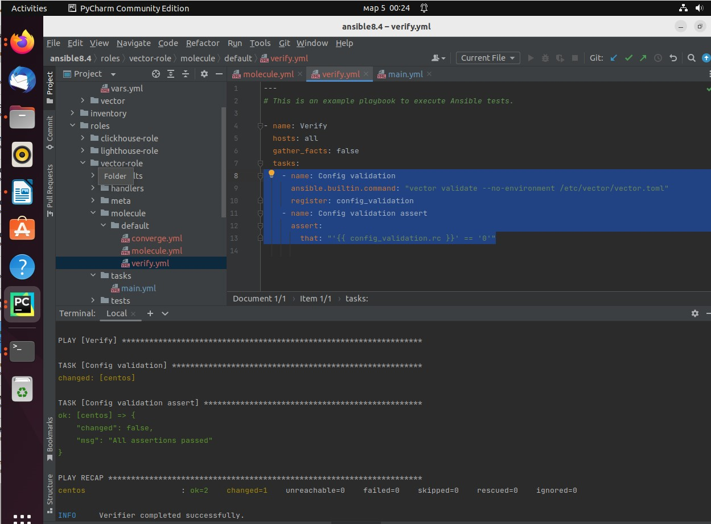

#### 5. Запустите тестирование роли повторно и проверьте, что оно прошло успешно. ####

### Tox ###

#### 1. Добавьте в директорию с vector-role файлы из директории. ####

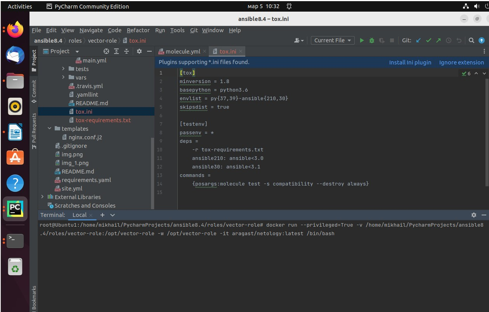

#### 2. Запустите docker run --privileged=True -v <path_to_repo>:/opt/vector-role -w /opt/vector-role -it aragast/netology:latest /bin/bash, где path_to_repo — путь до корня репозитория с vector-role на вашей файловой системе. ####


#### 3. Внутри контейнера выполните команду tox, посмотрите на вывод ####

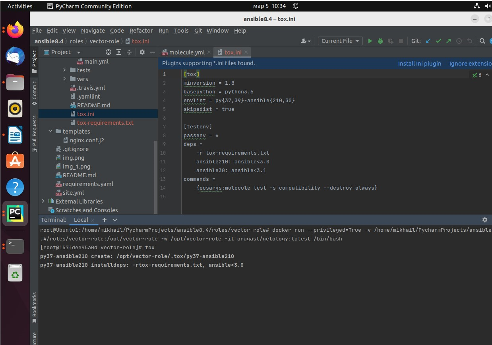

Получаю ошибку. Пробовал по рекомендациям в интернете переустановить molecula-driver и т.д. - не помогает.

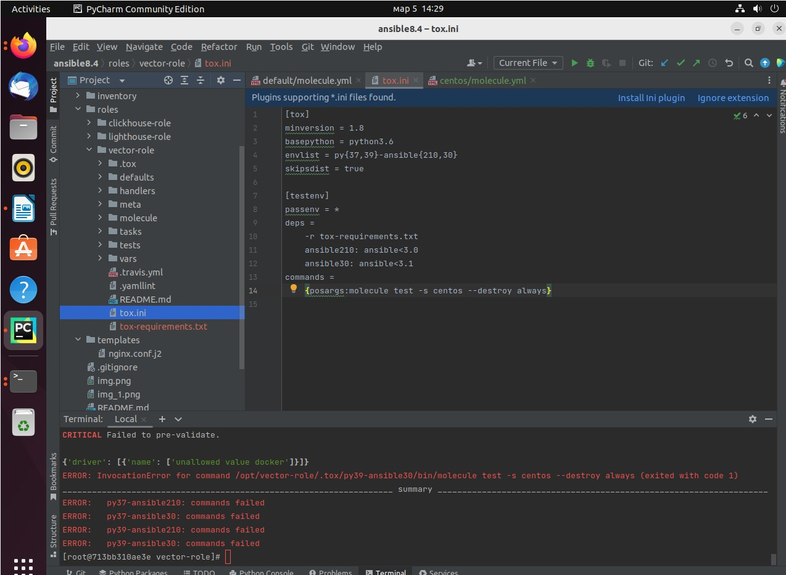

#### 4. Создайте облегчённый сценарий для molecule с драйвером molecule_podman. Проверьте его на исполнимость. ####

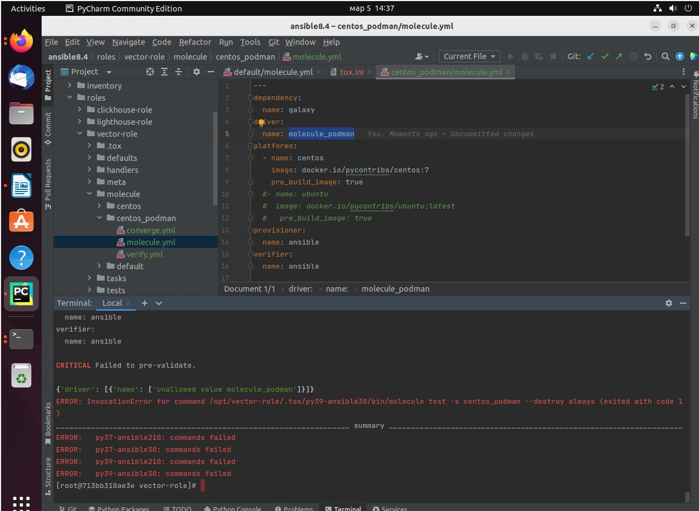

#### 5. правильную команду в tox.ini, чтобы запускался облегчённый сценарий. ####

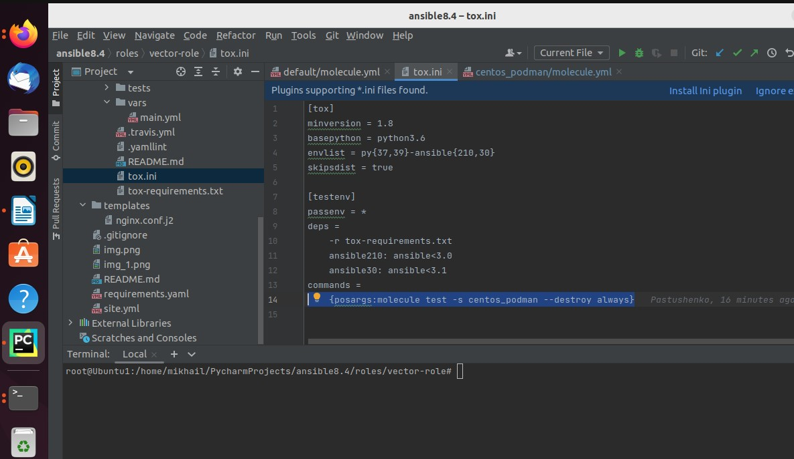

#### 6.Запустите команду tox. Убедитесь, что всё отработало успешно. ####

Получаю ту же ошибку


