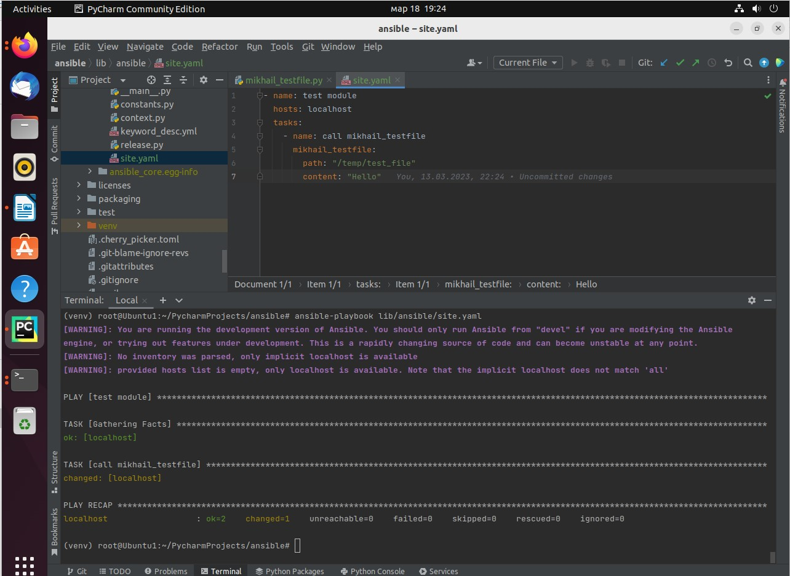

## Домашнее задание к занятию 6 «Создание собственных модулей» ##

### Основная часть ###

#### Шаг 1. В виртуальном окружении создайте новый my_own_module.py файл. ####

#### Шаг 2. Наполните его содержимым: ####

#### Шаг 3. Заполните файл в соответствии с требованиями Ansible так, чтобы он выполнял основную задачу: module должен создавать текстовый файл на удалённом хосте по пути, определённом в параметре path, с содержимым, определённым в параметре content ####

#### Шаг 4. Проверьте module на исполняемость локально. ####

#### Шаг 5. Напишите single task playbook и используйте module в нём. ####

#### Шаг 6. Проверьте через playbook на идемпотентность. ####

#### Шаг 7. Выйдите из виртуального окружения. ####

#### Шаг 8. Инициализируйте новую collection:  ####

#### Шаг 9. В эту collection перенесите свой module в соответствующую директорию. ####

#### Шаг 10. Single task playbook преобразуйте в single task role и перенесите в collection. У role должны быть default всех параметров module. ####

#### Шаг 11. Создайте playbook для использования этой role. ####

#### Шаг 12. Выложите в свой репозиторий, поставьте тег 1.0.0 на этот коммит. ####

https://github.com/MikhailPastushenko/my_own_collection/tree/1.0.0

#### Шаг 13. Создайте .tar.gz этой collection: ansible-galaxy collection build в корневой директории collection ####

#### Шаг 14. Создайте ещё одну директорию любого наименования, перенесите туда single task playbook и архив c collection. ####

#### Шаг15. Установите collection из локального архива: ansible-galaxy collection install <archivename>.tar.gz ####

#### Шаг 16. Запустите playbook, убедитесь, что он работает. ####

