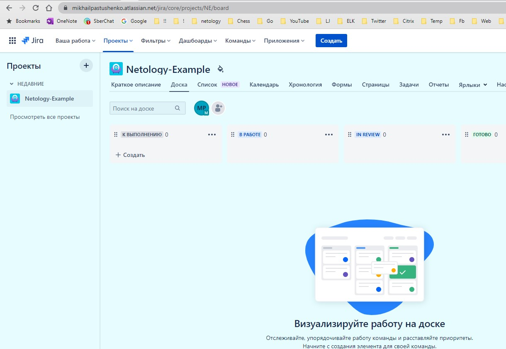
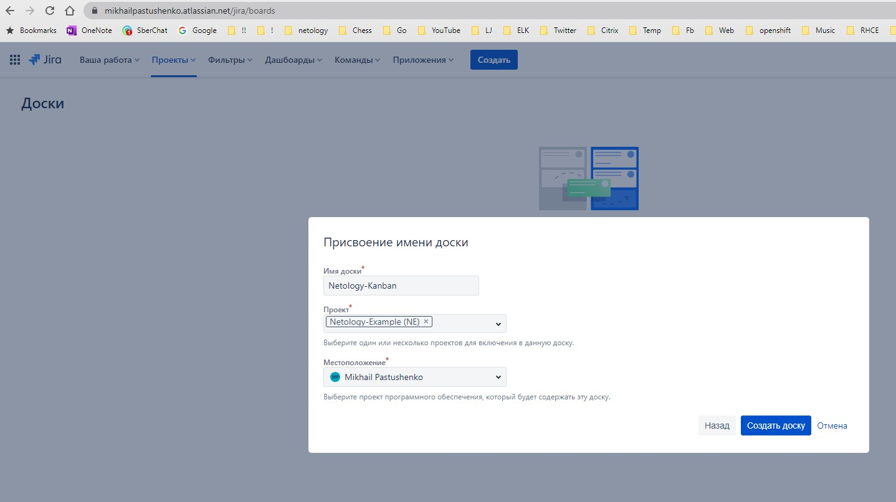
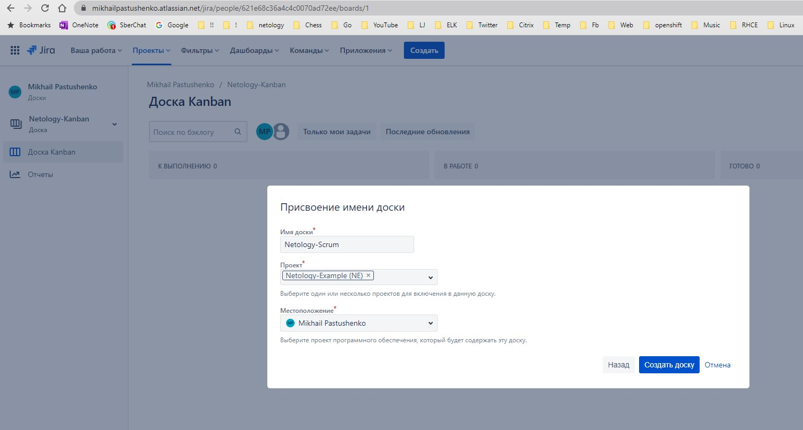
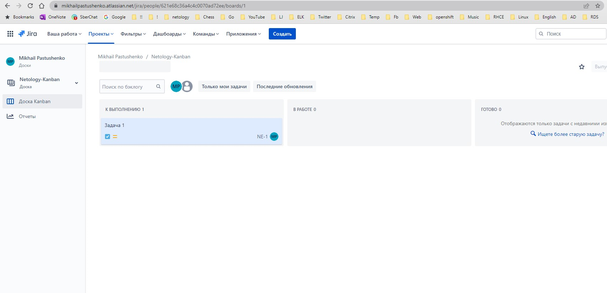
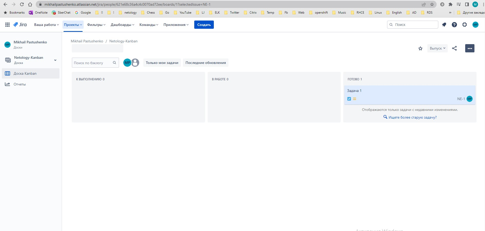
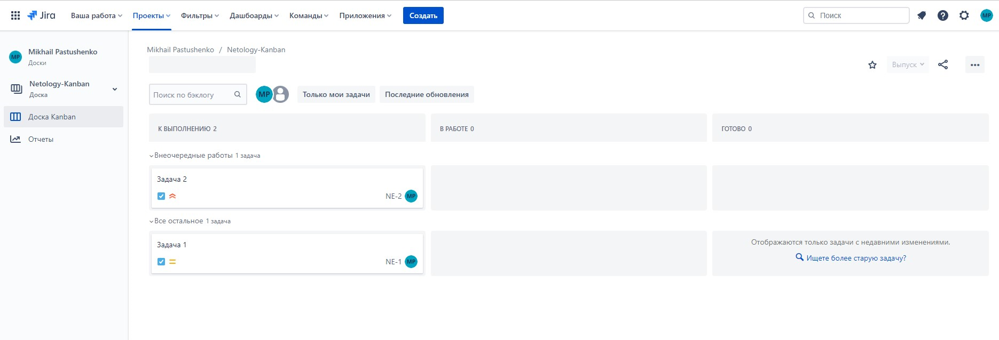
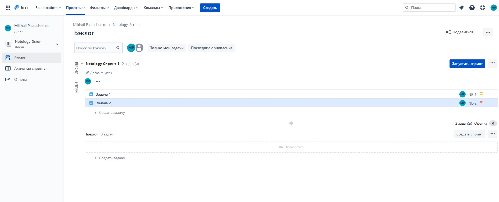
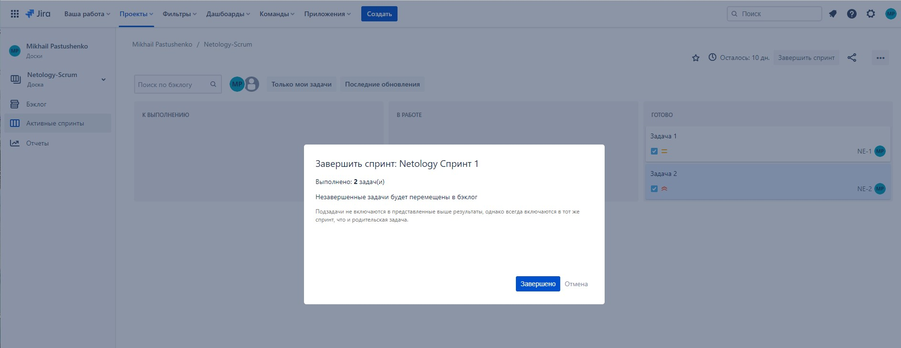

# Домашнее задание к занятию 7 «Жизненный цикл ПО» ##

### Подготовка к выполнению ###

#### Получить бесплатную версию Jira.  ####
#### Настроить её для своей команды разработки. ####
#### Создать доски Kanban и Scrum. ####

### Основная часть ###

#### 1. Создайте задачу с типом bug, попытайтесь провести его по всему workflow до Done. ####
#### 2. Создайте задачу с типом epic, к ней привяжите несколько задач с типом task, проведите их по всему workflow до Done. #### 
#### 3. При проведении обеих задач по статусам используйте kanban. #### 

Jira почему-то позволяет создать только задачу типа Task. Ни Bug, ни Epic недоступны

#### 4.Верните задачи в статус Open. ####

#### 5. Перейдите в Scrum, запланируйте новый спринт, состоящий из задач эпика и одного бага, стартуйте спринт, проведите задачи до состояния Closed. Закройте спринт. ####

#### 6.Если всё отработалось в рамках ожидания — выгрузите схемы workflow для импорта в XML. Файлы с workflow приложите к решению задания. ####

