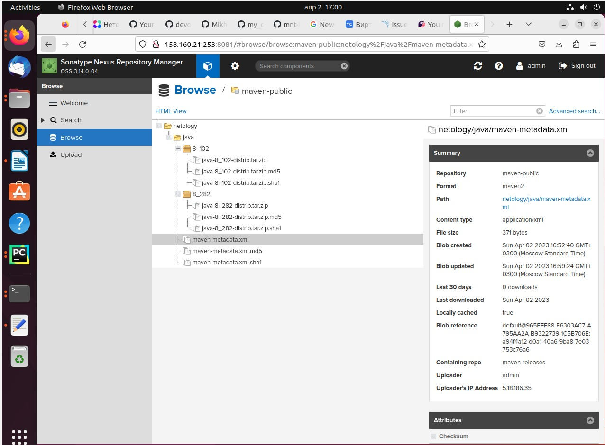

## Домашнее задание к занятию 9 «Процессы CI/CD» ##

### Подготовка к выполнению ###

#### 1. Создайте два VM в Yandex Cloud с параметрами: 2CPU 4RAM Centos7 (остальное по минимальным требованиям). ####

#### 2.Пропишите в inventory playbook созданные хосты. ####

#### 3. Добавьте в files файл со своим публичным ключом (id_rsa.pub). Если ключ называется иначе — найдите таску в плейбуке, которая использует id_rsa.pub имя, и исправьте на своё. ####

#### 4.Запустите playbook, ожидайте успешного завершения. ####

#### 5.Проверьте готовность SonarQube через браузер. ####
#### 6.Зайдите под admin\admin, поменяйте пароль на свой. ####

#### 7. Проверьте готовность Nexus через бразуер. ####
#### 8. Подключитесь под admin\admin123, поменяйте пароль, сохраните анонимный доступ. ####

### Знакомоство с SonarQube ###

### Основная часть ###

#### 1. Создайте новый проект, название произвольное ####

#### 2.Скачайте пакет sonar-scanner, который вам предлагает скачать SonarQube. ####

#### 3.Сделайте так, чтобы binary был доступен через вызов в shell (или поменяйте переменную PATH, или любой другой, удобный вам способ). ####

#### 4.Проверьте sonar-scanner --version ####

#### 5.Запустите анализатор против кода из директории example с дополнительным ключом -Dsonar.coverage.exclusions=fail.py ####

#### 6.Посмотрите результат в интерфейсе. #### 

#### 7.Исправьте ошибки, которые он выявил, включая warnings. ####

#### 8.Запустите анализатор повторно — проверьте, что QG пройдены успешно. ####

### Знакомство с Nexus ###

### Основная часть ###

#### 1.В репозиторий maven-public загрузите артефакт с GAV-параметрами ####

#### 2.В него же загрузите такой же артефакт, но с version: 8_102. ####
#### 3.Проверьте, что все файлы загрузились успешно. ####
#### 4.В ответе пришлите файл maven-metadata.xml для этого артефекта. ####

### Знакомство с Maven ###

### Подготовка к выполнению  ###

#### 1.Скачайте дистрибутив с maven. ####
#### 2.Разархивируйте, сделайте так, чтобы binary был доступен через вызов в shell (или поменяйте переменную PATH, или любой другой, удобный вам способ). ####

#### 3.Удалите из apache-maven-<version>/conf/settings.xml упоминание о правиле, отвергающем HTTP- соединение — раздел mirrors —> id: my-repository-http-unblocker. ####

#### 4.Проверьте mvn --version ####

### Основная часть ###

#### 1.Поменяйте в pom.xml блок с зависимостями под ваш артефакт из первого пункта задания для Nexus (java с версией 8_282). ####

#### 2.Запустите команду mvn package в директории с pom.xml, ожидайте успешного окончания. ####

#### 3.Проверьте директорию ~/.m2/repository/, найдите ваш артефакт. ####

